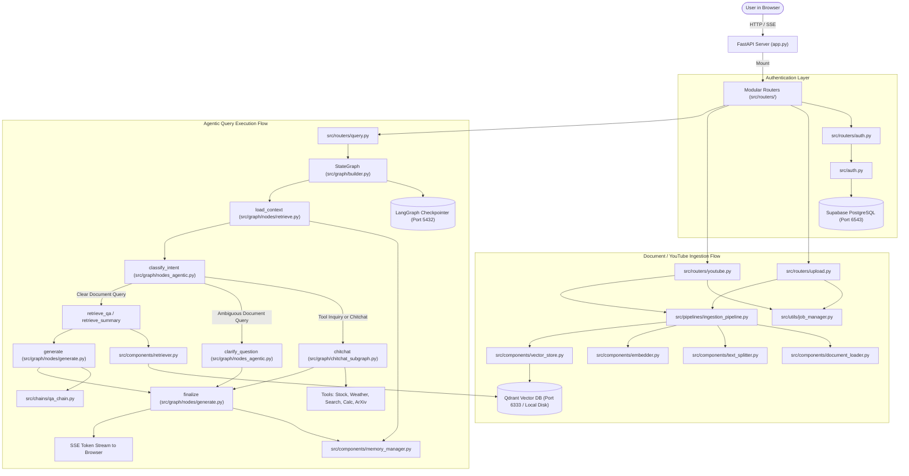

# DocuVortex (DocMind) — System Architecture & Documentation Index

Welcome to the **DocuVortex** documentation directory (`MD-FILES/`). This folder mirrors the complete repository structure of DocuVortex (`arpitkanani/RAG-Project_DocMind`), providing deep, structured, AI-readable documentation for every script, router, graph node, component, utility, and configuration file.

If you are an AI assistant or human engineer inspecting this project, this document serves as the master navigation map.

---

## 1. System Overview & Technology Stack

DocuVortex is an enterprise-grade, agentic Retrieval-Augmented Generation (RAG) and conversational AI workspace. It allows users to upload multimodal files (PDF, DOCX, TXT, CSV, XLSX, Markdown) or YouTube URLs, extract and index their contents into a vector database, and converse with an intelligent LangGraph agent that switches seamlessly between grounded document synthesis and real-time live tools (Stock quotes, Weather forecasts, Web search, Math calculation, arXiv preprints).

### Core Technology Stack
- **Web Framework:** FastAPI (Asynchronous Python 3.10+)
- **Agentic Workflow:** LangGraph (`StateGraph`, Checkpointing with `AsyncPostgresSaver`)
- **LLM Orchestration:** LangChain Core, LangChain Google GenAI (`Gemini 3.8/3.7/3.6/3.5`), LangChain Groq (`openai/gpt-oss-20b`, `openai/gpt-oss-120b`, `qwen/qwen3.8-27b`)
- **Embeddings:** HuggingFace `BAAI/bge-small-en-v1.5` (Local in-memory singleton via `sentence-transformers`)
- **Vector Database:** Qdrant (Remote Docker port `6333` with automatic embedded disk storage fallback at `data/qdrant_storage`)
- **Relational & Chat Memory Database:** PostgreSQL (Supabase pooled port `6543` for application queries, direct port `5432` for LangGraph checkpointer)
- **Frontend:** Vanilla JavaScript (ES6+, SSE streaming, typewriter rendering, zero node-modules build required), Jinja2 HTML templates, CSS3

---

## 2. Global Request & Data Lifecycle

---

## 3. Directory Structure & Documentation Map

Each link below directs to the dedicated `.md` file detailing that script's inputs, outputs, connections, and execution flow:

### Root Execution & Tests
- [`app.md`](app.md) — Main FastAPI application entrypoint, lifespan startup/shutdown, database table auto-initialization, LangGraph checkpointer pool, background data retention, and router registration.
- [`check_db.md`](check_db.md) — Standalone diagnostic script for testing Supabase PostgreSQL connections (pooler port 6543 & direct port 5432) and schema tables.
- [`endpoint_regression_check.md`](endpoint_regression_check.md) — Mocked dependency unit and integration test suite verifying all HTTP API contracts.
- [`seed_user.md`](seed_user.md) — CLI utility to create or update users in PostgreSQL and generate secure API keys (`dk_live_...`).
- [`test.md`](test.md) — Live availability and rate-limit probe testing active Gemini and Groq model IDs.
- [`wipe_data.md`](wipe_data.md) — Complete cleanup CLI to truncate PostgreSQL session/chat tables and wipe Qdrant vector collections.

### Configuration & Database Initialization
- [`config/config.md`](config/config.md) — Central YAML configuration reference (LLM parameters, rate limits, text splitting, MMR retrieval, Qdrant URL, and PostgreSQL settings).
- [`database/init.md`](database/init.md) — SQL DDL schema initialization script for PostgreSQL (users, sessions, messages, attachments, summaries, and performance indexes).

### Core Application Modules (`src/`)
- [`src/auth.md`](src/auth.md) — API key authentication utilities, SHA-256 key hashing, 30-day JWT sessions, guest mode fallback, and FastAPI `get_current_user` dependency.
- [`src/exception.md`](src/exception.md) — Custom error hierarchy (`CustomException`, `CollectionNotFoundError`, `KnowledgeBaseEmptyError`).
- [`src/logger.md`](src/logger.md) — System logging configuration, log formatting, and file-based rotation.
- [`src/schemas.md`](src/schemas.md) — Pydantic models for incoming requests and outgoing API payloads (`QueryRequest`, `YouTubeRequest`, `SessionCreateResponse`).

### Chains (`src/chains/`)
- [`src/chains/qa_chain.md`](src/chains/qa_chain.md) — Grounded question-answering chain, strict document grounding prompts, multi-model fallback builder (`_build_llm`), citation generator, and answer sanitizer.

### Components (`src/components/`)
- [`src/components/document_loader.md`](src/components/document_loader.md) — Multi-format file parsing (PDF layout/plain, TXT, DOCX, CSV, XLSX, Markdown) and YouTube transcript segment retrieval.
- [`src/components/embedder.md`](src/components/embedder.md) — Thread-safe singleton embedding manager loading `BAAI/bge-small-en-v1.5` locally once per process.
- [`src/components/memory_manager.md`](src/components/memory_manager.md) — PostgreSQL-backed multi-turn chat memory and session manager with automatic background LLM summarization.
- [`src/components/retriever.md`](src/components/retriever.md) — Hybrid semantic and lexical search engine featuring query expansion, stopword filtering, phrase matching, and cross-collection re-ranking.
- [`src/components/text_splitter.md`](src/components/text_splitter.md) — Recursive character chunker with streaming generator support (`lazy_split`).
- [`src/components/vector_store.md`](src/components/vector_store.md) — Qdrant vector store manager with automatic failover between remote Qdrant Docker and local embedded disk storage.

### Database (`src/database/`)
- [`src/database/db.md`](src/database/db.md) — Threaded PostgreSQL connection pool manager, cursor context manager (`get_db_cursor`), and defensive schema migrations.

### LangGraph Agentic Workflow (`src/graph/`)
- [`src/graph/agent.md`](src/graph/agent.md) — Stateless ReAct agent assembly and token streaming runner.
- [`src/graph/agent_nodes.md`](src/graph/agent_nodes.md) — Decision nodes (`chat_node`, `tools_node`, `should_continue`) for the ReAct document agent.
- [`src/graph/builder.md`](src/graph/builder.md) — Main asynchronous `StateGraph` workflow compiler linking intent routing, document retrieval, and grounded generation.
- [`src/graph/chitchat_subgraph.md`](src/graph/chitchat_subgraph.md) — Prebuilt multi-turn ReAct conversational agent handling live tool calling and answer structuring.
- [`src/graph/chitchat_tools.md`](src/graph/chitchat_tools.md) — Backwards-compatibility re-export module for conversational tools.
- [`src/graph/helpers.md`](src/graph/helpers.md) — LLM response text parsing and block normalization utilities.
- [`src/graph/nodes_agentic.md`](src/graph/nodes_agentic.py) — Core graph nodes (`classify_intent`, `clarify_question`, `grade_documents`, `fallback_response`, `run_react_agent`).
- [`src/graph/state.md`](src/graph/state.md) — Typed state definitions (`RAGState`, `AgentState`, `ChitChatState`).
- [`src/graph/tools.md`](src/graph/tools.md) — Complete tool definitions (`rag_query`, `summarize_document`, `get_stock_price`, `get_weather`, `calculator`, `search_arxiv`, `search_tool`).
- [`src/graph/nodes/generate.md`](src/graph/nodes/generate.md) — Answer synthesis, citation attachment, and PostgreSQL message persistence nodes (`generate_node`, `finalize_node`, `fallback_node`).
- [`src/graph/nodes/retrieve.md`](src/graph/nodes/retrieve.md) — Context loading and vector search nodes (`load_context_node`, `retrieve_qa_node`, `retrieve_summary_node`).

### Ingestion Pipelines (`src/pipelines/`)
- [`src/pipelines/ingestion_pipeline.md`](src/pipelines/ingestion_pipeline.md) — End-to-end ingestion orchestrator connecting loader, splitter, and vector database with progress callbacks and automatic rollback.

### API Routers (`src/routers/`)
- [`src/routers/auth.md`](src/routers/auth.md) — Authentication routes (math captcha, login/registration, single-click password recovery, API key verification, session status, logout).
- [`src/routers/collections.md`](src/routers/collections.md) — Vector store collection inspection and deletion endpoints.
- [`src/routers/health.md`](src/routers/health.md) — Health check endpoint (`/health`).
- [`src/routers/pages.md`](src/routers/pages.md) — Frontend HTML template rendering (`/`, `/app`, `/home`, `/login`, `/favicon.ico`).
- [`src/routers/query.md`](src/routers/query.py) — Real-time Server-Sent Events (SSE) streaming query endpoint (`/query`).
- [`src/routers/sessions.md`](src/routers/sessions.md) — Chat session lifecycle, history listing, session clearing, and attachment management.
- [`src/routers/upload.md`](src/routers/upload.md) — Document file upload endpoint with asynchronous background ingestion jobs (`/upload`, `/upload/status/{id}`).
- [`src/routers/youtube.md`](src/routers/youtube.md) — YouTube URL ingestion endpoint with background job processing (`/youtube`).

### Utilities (`src/utils/`)
- [`src/utils/file_helper.md`](src/utils/file_helper.md) — File type/size validation, upload storage management, and temporary file cleanup.
- [`src/utils/helpers.md`](src/utils/helpers.md) — Template partial inclusion, session scope resolution, collection cleanup helpers, and text extraction.
- [`src/utils/job_manager.md`](src/utils/job_manager.md) — In-memory thread-safe tracker for asynchronous background upload/indexing jobs.
- [`src/utils/rate_limiter.md`](src/utils/rate_limiter.md) — Sliding-window rate limiter supporting sync and async token acquisition.
- [`src/utils/youtube_helper.md`](src/utils/youtube_helper.md) — YouTube URL parsing, video ID extraction, and transcript segment retrieval.

### Frontend Client Scripts (`templates/static/js/`)
- [`templates/static/js/app_new.md`](templates/static/js/app_new.md) — Core workspace client-side controller, SSE stream parser, typewriter animation, session switcher, and modal managers.
- [`templates/static/js/auth.md`](templates/static/js/auth.md) — Authentication modal logic, math captcha handling, and single-click password retrieval.
- [`templates/static/js/landing.md`](templates/static/js/landing.md) — Landing page interactions and app redirection.
