# Module Documentation: `app.py`

## 1. Overview & Purpose
`app.py` is the root application entry point for **DocuVortex (DocMind)**. It configures and launches the FastAPI application, manages system lifecycles (`@asynccontextmanager lifespan`), initializes the PostgreSQL schema and connection pools, boots the singleton local embedding model, runs background data retention workers, sets up the LangGraph PostgreSQL checkpointer pool (`AsyncPostgresSaver`), and registers all modular API routers and static asset mount points.

---

## 2. Key Components & Functions

### `_get_checkpointer_conn_uri() -> str`
- **Purpose:** Constructs the connection URI specifically for the LangGraph checkpointer.
- **Critical Requirement:** LangGraph's `AsyncPostgresSaver` requires prepared statements. Therefore, this must connect directly to PostgreSQL on **Port 5432** (or `LANGGRAPH_DATABASE_URL`), bypassing transaction poolers like PgBouncer on Port 6543 which disallow prepared statements.
- **Fallback:** Defaults to values from `config/config.yaml` (`postgres` section) or environment variables (`POSTGRES_HOST`, `POSTGRES_PORT`, etc.).

### `_run_data_retention_cleanup() -> None` (Async Worker)
- **Purpose:** Background maintenance task executed periodically (every 24 hours).
- **Behavior:** Wipes chat sessions and uploaded attachment metadata from PostgreSQL that have had no user activity for over 90 days (`updated_at < now() - interval '90 days'`).

### `lifespan(app: FastAPI)` (Context Manager)
- **Lifecycle Hook:** Runs upon FastAPI server boot and clean shutdown.
- **Step 0:** Cleans up orphaned temporary session files (`*.ses`, `:memory:.ses`).
- **Step 1:** Calls `init_db()` and `test_connection()` to defensively verify and migrate PostgreSQL tables.
- **Step 2:** Instantiates `Embedder()` to load HuggingFace embeddings (`BAAI/bge-small-en-v1.5`) into RAM once per process.
- **Step 3:** Boots `AsyncConnectionPool` and `AsyncPostgresSaver` on port 5432, compiles the LangGraph RAG workflow (`build_rag_graph(checkpointer=checkpointer)`), and attaches it to `app.state.rag_graph`.
- **Step 4:** Cancels background retention tasks cleanly during shutdown.

---

## 3. Connections & Component Mapping

```mermaid
flowchart TD
    app["app.py (FastAPI App)"]
    
    subgraph StartupLifespan ["Lifespan Startup"]
        app -->|1. Test & Init| DBInit["src.database.db: init_db(), test_connection()"]
        app -->|2. Preload Model| Embedder["src.components.embedder: Embedder()"]
        app -->|3. Compile Workflow| LangGraph["src.graph.builder: build_rag_graph()"]
        app -->|4. Launch Worker| Worker["_run_data_retention_cleanup()"]
    end
    
    subgraph RoutersMounted ["Mounted API Routers"]
        app --> R1["src.routers.auth.router (/api/auth)"]
        app --> R2["src.routers.health.router (/health)"]
        app --> R3["src.routers.pages.router (/, /app, /landing)"]
        app --> R4["src.routers.query.router (/query)"]
        app --> R5["src.routers.upload.router (/upload)"]
        app --> R6["src.routers.youtube.router (/youtube)"]
        app --> R7["src.routers.collections.router (/collections)"]
        app --> R8["src.routers.sessions.router (/sessions, /memory)"]
    end
    
    subgraph StaticFiles ["Static Mount"]
        app -->|Mount /static| Static["templates/static/"]
    end
```

### Upstream Callers:
- ASGI servers such as Uvicorn or Hypercorn (e.g., `uvicorn app:app --host 0.0.0.0 --port 8000 --reload`).
- Production Docker container (`Dockerfile` runs `uvicorn app:app`).

### Downstream Dependencies:
- **`src.database.db`:** Connection pool testing and schema bootstrap.
- **`src.components.embedder`:** HuggingFace embedding singleton warm-up.
- **`src.graph.builder`:** Graph compilation with checkpointer persistence.
- **`psycopg_pool.AsyncConnectionPool` & `langgraph.checkpoint.postgres.aio.AsyncPostgresSaver`:** StateGraph thread checkpointer.
- **`src.routers.*`:** All 8 modular REST endpoints.

---

## 4. Runtime Use-Case Flow

1. **Server Start:**
   - Environment variables loaded via `dotenv`.
   - `lifespan` runs: PostgreSQL schema verified, embedding model loaded into GPU/CPU memory, checkpointer pool attached to `app.state.rag_graph`.
   - Static files mounted to `/static`.
2. **Handling User Requests:**
   - Any HTTP request received is dispatched to the corresponding router under `src/routers/`.
   - `/query` accesses `request.app.state.rag_graph` for stateful query streaming.
3. **Server Teardown:**
   - Background retention loop cleanly canceled; checkpointer connection pool closed.

---

## 5. AI & Developer Guidelines

- **Port Distinction:** Never configure `AsyncPostgresSaver` to connect via transaction poolers (Port 6543). It will fail with `prepared statement "..." does not exist`. Keep it on Port 5432 with `autocommit=True`.
- **Checkpointer Fallback:** If the checkpointer pool fails or encounters a connection drop, `app.py` catches the error and compiles an un-checkpointed `build_rag_graph(checkpointer=None)` to ensure query serving is never completely disrupted.
