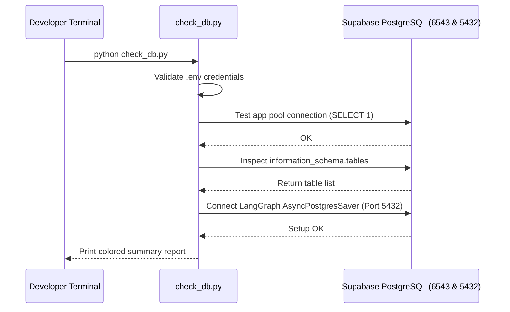

# Module Documentation: `check_db.py`

## 1. Overview & Purpose
`check_db.py` is a standalone command-line verification and diagnostic script. It audits connectivity to the Supabase PostgreSQL database across both required network configurations (the application pooler on Port 6543 and the direct connection on Port 5432 for LangGraph), verifies table schema existence, and tests checkpointer initialization.

---

## 2. Key Components & Functions

### `test_supabase()`
Main execution function executing four distinct checks:
1. **Environment Variables Audit:** Inspects `DATABASE_URL` (Port 6543) and `LANGGRAPH_DATABASE_URL` (Port 5432).
2. **Application Pool Connection Check:** Calls `src.database.db:get_pool()` and `test_connection()` using `psycopg2.pool.ThreadedConnectionPool`.
3. **Table Inspection & Schema Migration:** Invokes `init_db("database/init.sql")` and queries `information_schema.tables` to ensure all 6 required tables exist (`users`, `user_sessions`, `sessions`, `messages`, `attachments`, `session_summaries`).
4. **LangGraph Checkpointer Pool Verification:** Connects via `psycopg_pool.AsyncConnectionPool` and tests `AsyncPostgresSaver(lg_pool).setup()`.

---

## 3. Connections & Component Mapping

- **Direct Caller:** Terminal CLI: `python check_db.py`.
- **Downstream Dependencies:**
  - `src.database.db`: Uses `get_pool()`, `test_connection()`, `init_db()`, `get_db_cursor()`.
  - `database/init.sql`: Evaluates default SQL schema.
  - `langgraph.checkpoint.postgres.aio.AsyncPostgresSaver`: Tests direct checkpoint table creation.

---

## 4. Runtime Use-Case Flow

---

## 5. AI & Developer Guidelines
- Run this script first whenever onboarding to a new environment or after modifying `.env` to verify database health before launching `app.py`.
