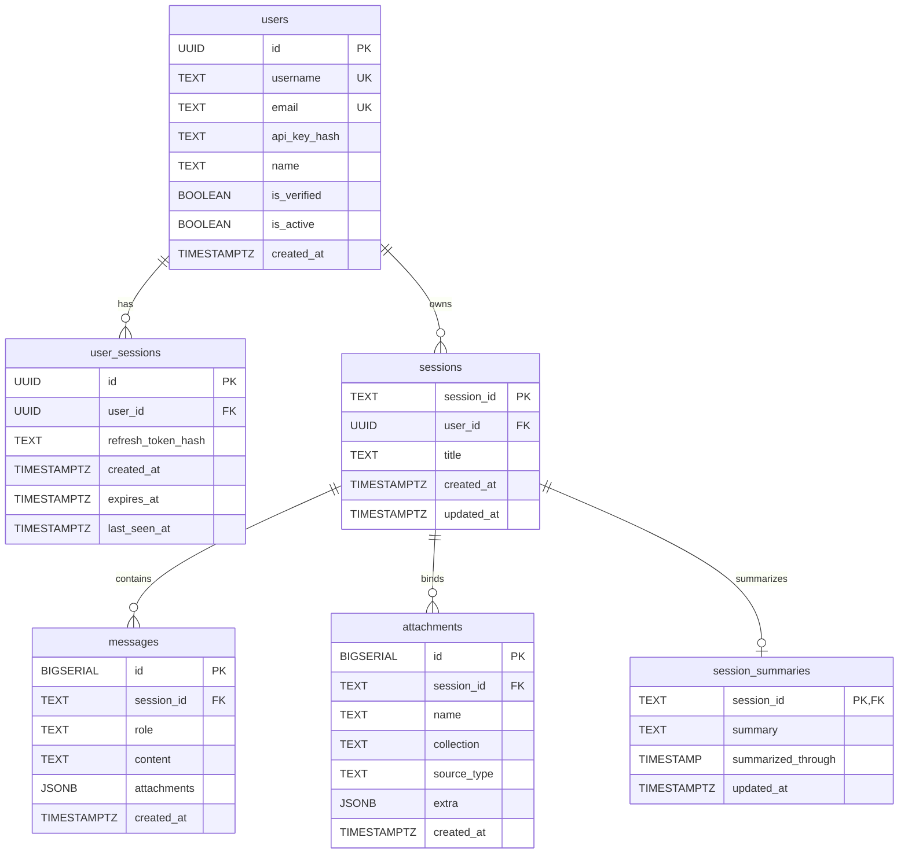

# Database Schema Documentation: `database/init.sql`

## 1. Overview & Purpose
`database/init.sql` establishes the relational PostgreSQL database schema for DocuVortex on Supabase. It enables cryptographic extensions (`pgcrypto`), provisions primary tables for user authentication, session management, multi-turn chat persistence, document attachment bindings, and background session summaries, and creates indexes for optimal query execution.

---

## 2. Entity Relationship Diagram (ERD)

---

## 3. Table Definitions & Constraints

### 1. `users`
- Stores user accounts, SHA-256 API key digests, and user profile metadata.
- **Constraints:** `id` UUID PK, `username` UNIQUE, `email` UNIQUE.

### 2. `user_sessions`
- Manages authenticated 30-day web client sessions.
- **Constraints:** `user_id` references `users(id) ON DELETE CASCADE`.

### 3. `sessions`
- Represents a discrete conversation workspace.
- **Constraints:** `session_id` TEXT PK, `user_id` references `users(id) ON DELETE CASCADE`.

### 4. `messages`
- Chronological message log.
- **Constraints:** `session_id` references `sessions(session_id) ON DELETE CASCADE`.
- `role`: `'human'` or `'ai'`.
- `attachments`: JSONB array of attached files at the time of the message.

### 5. `attachments`
- Tracks documents, spreadsheets, or YouTube videos bound to an active session.
- **Unique Constraint:** `(session_id, collection)` ensures a collection cannot be double-attached to the same chat.

### 6. `session_summaries`
- Stores condensed conversation summaries generated when message count exceeds `recent_messages_verbatim`.
- **Primary Key:** `session_id` references `sessions(session_id) ON DELETE CASCADE`.

---

## 4. Performance Indexes

- `idx_users_email` (Filtered unique index on non-null email).
- `idx_users_username` (Filtered unique index on non-null username).
- `idx_users_api_key_hash` (Fast lookup during API key auth).
- `idx_user_sessions_user_id`, `idx_user_sessions_expires` (Session validation).
- `idx_sessions_user_id` (Listing user sessions).
- `idx_messages_session_id`, `idx_messages_created_at` (Retrieving chat history).
- `idx_attachments_session_id` (Listing session documents).

---

## 5. Seed Data
Provisions a default `guest` user (`id: 00000000-0000-0000-0000-000000000001`, `username: guest`, `email: guest@docuvortex.local`) to ensure unauthenticated or first-time exploratory queries operate safely without foreign key errors.
