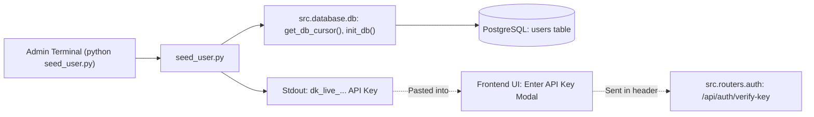

# Module Documentation: `seed_user.py`

## 1. Overview & Purpose
`seed_user.py` is an administrative CLI utility for seeding and managing user accounts in the Supabase PostgreSQL database. It generates secure cryptographic API keys (`dk_live_<hex>`), stores their SHA-256 hashes in PostgreSQL, and outputs the plaintext key for the user to authenticate into the frontend workspace.

---

## 2. Key Components & Functions

### `seed_user(username_arg: str = "test_user")`
- **Arguments:** `username_arg` (string, defaults to `"test_user"` or received via `sys.argv[1]`).
- **Process:**
  1. Verifies PostgreSQL connectivity via `test_connection()`.
  2. Ensures the database schema is initialized via `init_db("database/init.sql")`.
  3. Generates a 48-character cryptographic hex token prefixed with `dk_live_`.
  4. Hashes the key using SHA-256 (`hashlib.sha256(raw_api_key.encode()).hexdigest()`).
  5. Performs an `UPSERT` on the `users` table:
     - If the username or email exists, updates `api_key_hash`, `is_active=true`, `is_verified=true`.
     - If the user does not exist, inserts a new user record with a generated UUID.
  6. Formats and prints the credentials and copy-pasteable API key to `stdout`.

---

## 3. Connections & Component Mapping

### Upstream Callers:
- Developers and administrators setting up user accounts from the terminal.

### Downstream Dependencies:
- `src.database.db`: PostgreSQL connection pool and cursor management.
- `database/init.sql`: Table structure definition.
- `src.routers.auth`: Validates the hashed key generated by this script at runtime.

---

## 4. Runtime Use-Case Flow

1. Admin executes: `python seed_user.py "arpit"`.
2. Script verifies DB connectivity and creates/updates user `arpit` with email `arpit@docuvortex.local`.
3. Script outputs `dk_live_9a7b...`.
4. User opens browser at `http://localhost:8000/app` and pastes the key into the API key prompt.
5. The frontend stores the key in `localStorage.setItem('docuvortex.apiKey', ...)` and attaches it to all requests via `X-API-Key` headers.

---

## 5. AI & Developer Guidelines
- **Security:** The database never stores the plaintext API key; only the SHA-256 hash is saved in `users.api_key_hash`.
- **Foreign Key Safety:** Seeding users prevents foreign key constraint violations when creating chat sessions in `sessions.user_id`.
