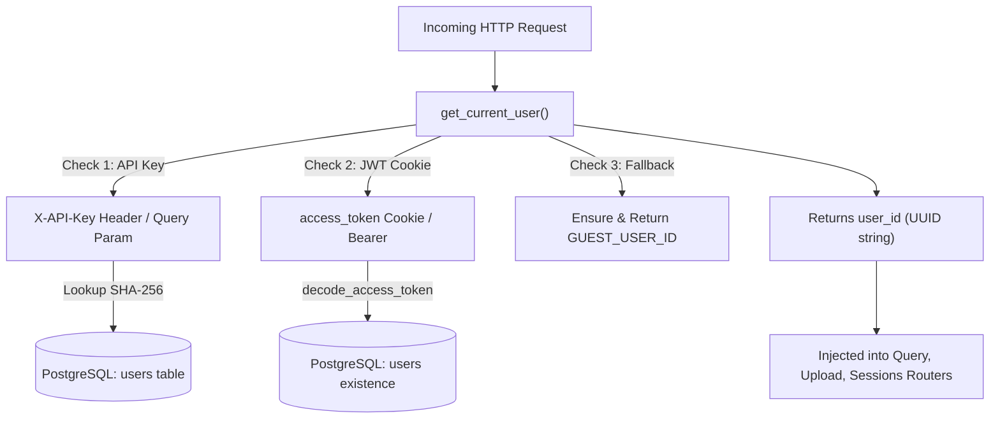

# Module Documentation: `src/auth.py`

## 1. Overview & Purpose
`src/auth.py` provides the security, cryptographic primitives, and session dependency logic for DocuVortex. The system uses an **API-key-first authentication model** (keys generated via `seed_user.py` or entered in the UI), paired with 30-day signed access tokens (JWT/HMAC) and an unauthenticated guest mode fallback.

Legacy password forms, math captcha challenges, and plain text password recovery mechanisms have been completely removed in favor of direct, reliable API key verification.

---

## 2. Key Components & Functions

### `hash_token(token: str) -> str`
- Computes the SHA-256 hash of a session/refresh token for secure database storage.

### `create_access_token(user_id: str, session_id: str, email: str = "", username: str = "") -> str`
- Issues a signed JWT access token valid for 30 days containing `sub` (`user_id`), `session_id`, `email`, and `username`. Includes HMAC token fallback if `PyJWT` is absent.

### `decode_access_token(token: str) -> Optional[dict]`
- Decodes and validates JWT claims or signed token payloads, verifying expiration timestamps.

### `_lookup_api_key_user(api_key_hash: str) -> Optional[dict]`
- Performs a database lookup against `users.api_key_hash` using the SHA-256 hash of the presented API key.

### `_ensure_guest_user() -> None`
- Defensively ensures the persistent guest user record exists in the `users` table (`GUEST_USER_ID = "00000000-0000-0000-0000-000000000001"`).

### `get_current_user(request: Request, x_api_key: Optional[str] = Header(None)) -> str` (FastAPI Dependency)
Resolves the requesting user's `user_id` using a 3-tier strategy:
1. **Strategy 1: Explicit API Key (Primary):** Checks `X-API-Key` header or `?api_key=` parameter. Computes SHA-256 of the key and queries `users.api_key_hash`. Returns matching user ID (or guest ID if key is `"guest"`). If key is present but invalid, raises HTTP 401.
2. **Strategy 2: Cookie / Bearer JWT:** Checks `access_token` cookie or `Authorization: Bearer <token>` header. Decodes token and verifies user exists in PostgreSQL.
3. **Strategy 3: Unauthenticated Fallback:** Defaults gracefully to `GUEST_USER_ID` (`00000000-0000-0000-0000-000000000001`), ensuring guest sessions, uploads, and queries never crash.

---

## 3. Connections & Component Mapping

### Upstream Callers:
- `src.routers.query:query`
- `src.routers.upload:upload_file`
- `src.routers.youtube:process_youtube`
- `src.routers.sessions:list_sessions`, `get_session`, `delete_session`, `clear_memory`
- `src.routers.auth:verify_key`, `session_status`

### Downstream Dependencies:
- `src.database.db:get_db_cursor`: Queries `users` and `user_sessions` tables.
- `src.logger.logging`: Security audit logging.

---

## 4. AI & Developer Guidelines
- **API Key Generation:** API keys follow the format `dk_live_<hex>` and are generated via `python seed_user.py <username>`. Raw keys are NEVER stored; only their SHA-256 hashes are persisted in `users.api_key_hash`.
- **Guest Safe Guarantee:** Never remove the guest user fallback in `get_current_user` unless strict mandatory login is required across all routes.
