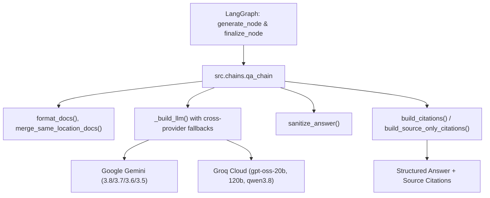

# Module Documentation: `src/chains/qa_chain.py`

## 1. Overview & Purpose
`src/chains/qa_chain.py` is the grounded synthesis engine of DocuVortex. It builds the primary Question-Answering LangChain runnable with cross-provider model fallbacks (Google Gemini & Groq), formats document passages into structured prompt context, detects document-wide summary requests, synthesizes deterministic source citations, and sanitizes generated text to enforce strict fact grounding.

---

## 2. Key Components & Functions

### Constants & Patterns
- **`NOT_FOUND_TOKEN = "DATA_NOT_FOUND"`**: Special token output by the LLM when context lacks information.
- **`FALLBACK_ANSWER = "I couldn't find information about that in the uploaded document(s)."`**: Polite refusal string.
- **`DOC_SUMMARY_PATTERNS`**: Regex detecting requests for holistic document overviews ("summarize this document", "give me a recap", "gist", "tl;dr").

### `is_summary_request(question: str) -> bool`
- Determines whether a query is a general whole-document summary request (which triggers chronological context extraction across all pages) or a specific semantic question (which requires vector search).
- Topic queries (e.g. asking for "Gantt chart", "budget", "author") return `False` even if they contain the word "summary".

### `format_docs(docs: list) -> str`
- Transforms retrieved `Document` chunks into clean, numbered source blocks:
  ```text
  Source Note 1
  Document: sample.pdf
  Location: page 4
  Section: Methodology
  Passage: ...text content...
  ```

### `build_citations(docs: list, answer: str = "") -> str`
- Deterministic citation builder.
- **Smart Filtering:** Matches distinctive tokens between the synthesized answer and retrieved documents, ensuring citations are attached **only** for documents whose concepts were actually incorporated into the answer.

### `build_source_only_citations(docs: list) -> str`
- Creates a clean list of unique document sources without page numbers (used for document summary responses where citing 20 individual pages would cause noise).

### `merge_same_location_docs(docs: list) -> list`
- Deduplicates and merges chunks that share the same source file and locator (e.g. chunks from the same PDF page) into a single document so the LLM does not narrate false multi-location citations.

### `prepare_clean_chat_history(chat_history: list) -> list`
- **Balanced Turn-Pair Sanitizer:** Filters conversation history to strictly balanced `(Human, AI)` pairs.
- If an AI response was a fallback, `DATA_NOT_FOUND`, or refusal, discards **BOTH** the human question and the AI reply so no orphaned, unanswered questions linger in the prompt.
- Retains at most the last 2 completed clean turn pairs (4 messages) to enable pronoun resolution without cross-topic distraction.

### `sanitize_answer(answer: str) -> str`
- Post-processing filter:
  - Strips accidental duplicate "Source:" sections generated by the LLM.
  - Replaces standalone `DATA_NOT_FOUND` with `FALLBACK_ANSWER`.
  - **Bleed & Phantom Heading Prevention:** Line-by-line block scrubber purges any leading or orphan category headings (e.g. "Estimated Cost", "Author of the Report") immediately preceding `DATA_NOT_FOUND` lines if a valid, substantive answer follows.
  - Removes conversational preambles ("Based on the provided documents...").
  - Catches pure refusals and conversation meta-dialogue ("The user asked...").
  - Deduplicates near-identical sentences.

### `_build_llm()`
- **Cross-Provider Automatic Fallback:**
  - If `LLM_PROVIDER=google`: Primary is `ChatGoogleGenerativeAI(gemini-3.8-flash)`. Fallbacks include other Gemini models followed by Groq (`openai/gpt-oss-120b`, `openai/gpt-oss-20b`, `qwen/qwen3.8-27b`).
  - If `LLM_PROVIDER=groq`: Primary is `ChatGroq(openai/gpt-oss-20b)`. Fallbacks include larger Groq models followed by Gemini models.
  - Automatically switches models if a provider experiences downtime or a 429 quota limit.

### `build_qa_chain()`
- Assembles the LangChain LCEL pipeline:
  ```python
  chain = (
      {"sources": format_docs, "question": RunnableLambda(...), "chat_history": RunnableLambda(...)}
      | QA_PROMPT
      | llm
      | StrOutputParser
  )
  ```

### `get_answer(...) -> str`
- Standalone execution entrypoint that handles history retrieval, document search, rate limiting, generation, citation appending, and message persistence.

---

## 3. Connections & Component Mapping



### Upstream Callers:
- `src.graph.nodes.generate: generate_node, finalize_node`
- `src.graph.nodes.retrieve: load_context_node, retrieve_qa_node, retrieve_summary_node`
- `src.components.memory_manager: _summarize_messages`

### Downstream Dependencies:
- `src.components.memory_manager.MemoryManager`
- `src.components.retriever.Retriever`
- `src.utils.rate_limiter: llm_rate_limiter, raise_as_rate_limit_error`
- `src.utils.helpers: extract_text`

---

## 4. AI & Developer Guidelines
- **Strict Grounding & Single-Question Focus:** `QA_PROMPT` instructs the model to reply with `DATA_NOT_FOUND` if facts are missing, and strictly forbids re-answering or carrying over topics/headings from prior turns in the chat history. Never loosen this prompt to permit external hallucinated speculation.
- **Rate-Limiter Protection:** Calls to the LLM must always be preceded by `llm_rate_limiter.acquire()` (or `await llm_rate_limiter.aacquire()`).
