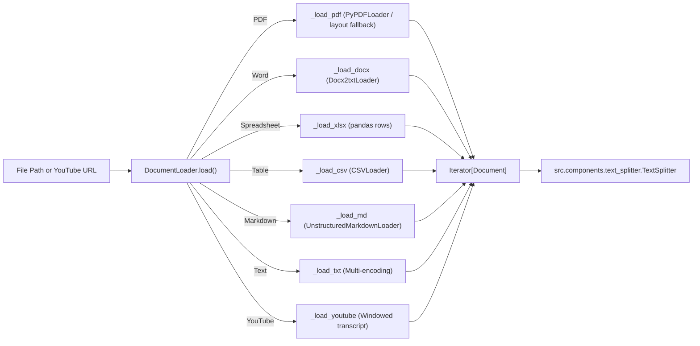

# Component Documentation: `src/components/document_loader.py`

## 1. Overview & Purpose
`src/components/document_loader.py` is the data ingestion parser for DocuVortex. It accepts local file paths or YouTube URLs and streams standardized LangChain `Document` objects with rich metadata (sources, page numbers, row numbers, and timestamp ranges).

---

## 2. Key Components & Functions

### `DocumentLoader`
Central class managing format dispatching.

#### `load(source: str) -> Iterator[Document]`
- Yields documents iteratively using a streaming generator.
- Dispatches based on file extension or YouTube URL:
  - **`.pdf`**: `_load_pdf(path)`
  - **`.txt`**: `_load_txt(path)`
  - **`.docx`**: `_load_docx(path)`
  - **`.csv`**: `_load_csv(path)`
  - **`.md`**: `_load_md(path)`
  - **`.xlsx`**: `_load_xlsx(path)`
  - **YouTube URL**: `_load_youtube(url)`

#### `_load_pdf(path: str) -> Iterator[Document]`
- Two-stage extraction:
  1. Tries `PyPDFLoader` with lazy streaming.
  2. If empty or missing text layers, falls back to direct `pypdf.PdfReader` with both `extraction_mode="layout"` and `"plain"` to preserve tables and columns.

#### `_load_txt(path: str) -> Iterator[Document]`
- Auto-detects and attempts multiple encodings: `utf-8`, `cp1252`, `latin-1`.

#### `_load_xlsx(path: str) -> Iterator[Document]`
- Uses `pandas` to read spreadsheet sheets, converting each row into a structured key-value text passage with `row` metadata.

#### `_load_youtube(url: str) -> Iterator[Document]`
- Retrieves transcript segments via `src.utils.youtube_helper:get_transcript_segments`.
- Merges short 5-15 word captions into coherent retrieval windows (~600 chars) preserving continuous timestamp ranges (`timestamp_range: "01:15-02:30"`).

---

## 3. Connections & Component Mapping

### Upstream Callers:
- `src.pipelines.ingestion_pipeline: IngestionPipeline.run()`

### Downstream Dependencies:
- `langchain_community.document_loaders`
- `pypdf`, `pandas`, `openpyxl`
- `src.utils.file_helper: get_file_extension`
- `src.utils.youtube_helper: is_youtube_url, get_transcript_segments`

---

## 4. AI & Developer Guidelines
- **Generator Pattern:** `load()` yields `Document` objects iteratively. Always consume it using iteration or generator pipes rather than casting the entire generator to a gigantic list in memory for large files.
