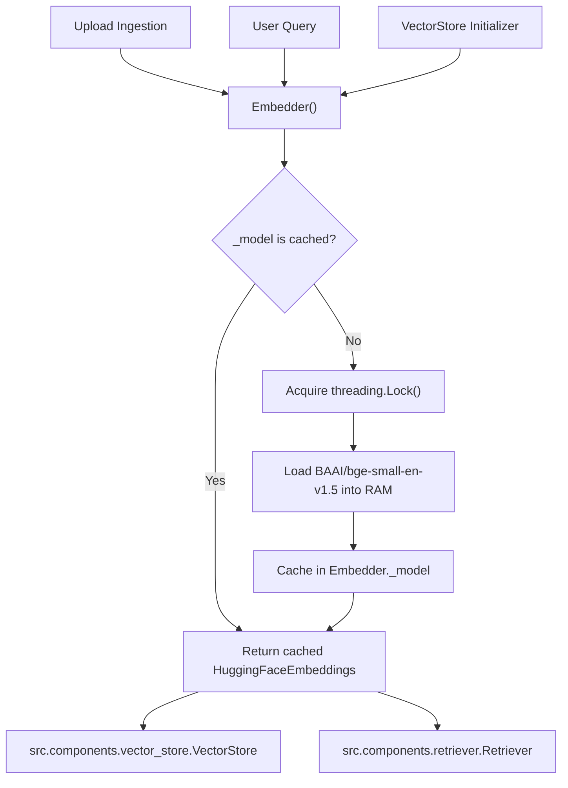

# Component Documentation: `src/components/embedder.py`

## 1. Overview & Purpose
`src/components/embedder.py` is the thread-safe singleton embedding provider for DocuVortex. It loads the local HuggingFace embedding model (`BAAI/bge-small-en-v1.5` by default) into memory exactly **once** per process using double-checked locking, completely eliminating per-request model reload latency.

---

## 2. Key Components & Functions

### `Embedder` (Singleton Pattern)

- **Class-Level Attributes:**
  - `_model`: Cached instance of `HuggingFaceEmbeddings`.
  - `_lock`: `threading.Lock()` guaranteeing thread-safe initialization.

#### `_initialize_model()`
- Uses double-checked locking.
- If `_model` is `None`, reads `model` and `device` from `config/config.yaml`.
- Configures BGE query instruction prefixes for asymmetric retrieval:
  ```python
  query_encode_kwargs["prompt"] = "Represent this question for searching relevant passages: "
  ```
- Sets `normalize_embeddings=True` for cosine distance compatibility.

#### `get_embedding_model(for_query: bool = False) -> Embeddings`
- `for_query=False`: Used when indexing and chunking documents.
- `for_query=True`: Used when embedding user questions (applies the BGE query prefix internally).

#### `generate_embedding(text: str) -> list`
- Generates a 384-dimensional dense vector for a single query string.

#### `generate_embeddings(texts: list) -> list`
- Batch-embeds a list of document chunk strings.

---

## 3. Connections & Component Mapping



### Upstream Callers:
- `app.py: lifespan` (pre-caches model on startup).
- `src.components.vector_store: VectorStore.__init__`.
- `src.components.retriever: Retriever`.

### Downstream Dependencies:
- `langchain_huggingface.HuggingFaceEmbeddings`
- `sentence_transformers`
- `config/config.yaml` (`embedding` section)

---

## 4. AI & Developer Guidelines
- **Offline Docker Support:** `HF_HUB_OFFLINE` and `TRANSFORMERS_OFFLINE` default to `"0"` for dynamic downloading, but can be set to `"1"` in production containers after pre-caching models.
- **Do Not Recreate Instances:** Always invoke `Embedder().get_embedding_model()` rather than constructing raw `HuggingFaceEmbeddings` manually to preserve memory.
