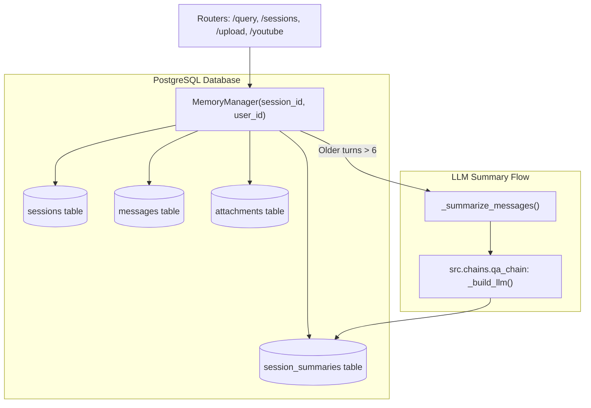

# Component Documentation: `src/components/memory_manager.py`

## 1. Overview & Purpose
`src/components/memory_manager.py` manages multi-session chat history, document attachments, and conversation summaries backed by Supabase PostgreSQL. It provides both synchronous and asynchronous interfaces (`save_message`/`asave_message`, `get_history`/`aget_history`), automatically trims expired messages past the retention window, and summarizes older conversation turns into concise rolling summaries using an LLM.

---

## 2. Key Components & Functions

### `MemoryManager`

#### `__init__(session_id: str = "default", user_id: str = None)`
- Requires a valid `user_id` to enforce strict multi-tenant tenant isolation.
- Reads `window_days` (default 7) and `recent_turns_to_keep` (default 6) from `config/config.yaml`.

#### `save_message(...) / asave_message(...)`
- Writes a message to the `messages` table with role (`'human'` or `'ai'`), text content, and optional `attachments` JSONB.
- Automatically generates session titles from the first human message (capped at 60 characters).
- Prunes expired messages older than `window_days`.

#### `get_history() -> List[BaseMessage] / aget_history()`
- Loads messages within the retention window.
- **Rolling Summarization:**
  - If total messages $\le$ `recent_turns_to_keep`, converts all to `HumanMessage` / `AIMessage` objects directly.
  - If total messages $>$ `recent_turns_to_keep`, partitions messages into `older` and `recent`.
  - Checks `session_summaries` table for a cached summary covering `older`. If missing or stale, calls `_summarize_messages` with an LLM.
  - Returns `[SystemMessage("Summary of earlier parts of this conversation:...")] + recent_messages`.

#### Attachment Management
- **`add_attachment(name, collection, source_type, extra)`**: Binds a document or YouTube video to the session in PostgreSQL.
- **`get_attachments() -> List[dict]`**: Returns active session attachments.
- **`remove_attachment(collection) -> bool`**: Removes an attachment and updates session timestamp.
- **`cleanup_attachments(valid_collections)`**: Prunes orphaned attachments whose collections no longer exist in Qdrant (with safety guards against empty input lists).

#### Session Lifecycle
- **`list_sessions(user_id, valid_collections) -> List[dict]`**: Returns all sessions belonging to the user with titles, message counts, attachment counts, and formatted relative timestamps. Auto-prunes empty abandoned sessions.
- **`clear()` / `clear_all(user_id)`**: Deletes session messages, summaries, and attachments.

---

## 3. Connections & Component Mapping

### Upstream Callers:
- `src.routers.query`: Saves user queries and AI responses; loads context for the graph.
- `src.routers.sessions`: Lists sessions, loads history, deletes chats and attachments.
- `src.routers.upload` & `src.routers.youtube`: Adds attachments upon successful ingestion.
- `src.graph.nodes.retrieve: load_context_node`
- `src.graph.nodes.generate: finalize_node`

### Downstream Dependencies:
- `src.database.db: get_db_cursor`
- `src.chains.qa_chain: _build_llm`
- `src.utils.rate_limiter: llm_rate_limiter`

---

## 4. AI & Developer Guidelines
- **User ID Requirement:** Never instantiate `MemoryManager` without a valid `user_id`. Doing so raises `CustomException(ValueError)`.
- **System Message Separation:** Summaries are injected as `SystemMessage` objects in `get_history()`. When feeding history into document QA prompts, strip these out in `generate_node` to prevent LLMs from narrating the summary instead of answering the query.
