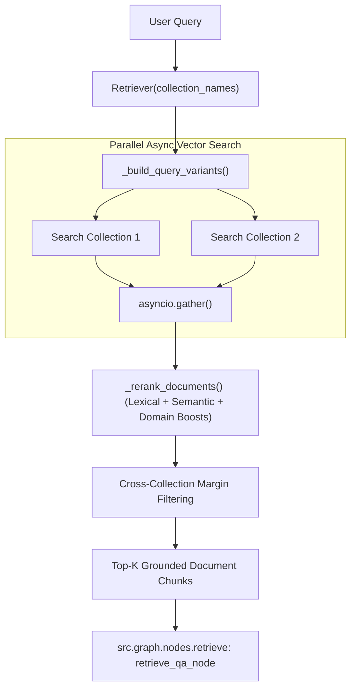

# Component Documentation: `src/components/retriever.py`

## 1. Overview & Purpose
`src/components/retriever.py` is the hybrid search and re-ranking component of DocuVortex. It executes asynchronous parallel vector searches across multiple Qdrant collections, generates query expansion variants, applies stopword filtering, matches exact multi-word phrases, and performs domain-aware lexical and front-matter boosts to surface the most relevant passages.

---

## 2. Key Components & Functions

### `Retriever`

#### `__init__(collection_names: List[str] | None = None)`
- Configures search hyperparameters from `config/config.yaml`:
  - `search_type`: `"similarity"` or `"mmr"`.
  - `k`: Target top-k passages (default 7).
  - `fetch_k`: Candidate pool (default 45).
  - `score_threshold`: Minimum semantic cosine similarity (default 0.30).
  - `collection_margin`: Score threshold ratio for cross-collection competition (default 0.78 - 0.80).
  - `doc_margin`: Threshold ratio for within-collection document competition.

#### `retrieve_ranked(query: str) -> List[Tuple[Document, float, float]]` (Async)
1. **Target Resolution:** Resolves available collections using `_resolve_target_collections()`. Strictly enforces session scope: if a session has no attached documents (`collection_names=[]` or removed attachments), it immediately returns `[]` without querying Qdrant, preventing cross-session data leaks.
2. **Query Expansion:** Builds query variants using `_build_query_variants(query)` (expanding acronyms, project names, authors, Gantt charts, budgets).
3. **Parallel Vector Search:** Fires concurrent asynchronous searches across all target collections using `asyncio.gather(*tasks)`.
4. **Lexical & Semantic Reranking:** Computes hybrid scores via `_rerank_documents()`.
5. **Cross-Collection Filtering:** Identifies the top-scoring collection and filters out non-competitive collections falling below `collection_margin * top_score`.
6. **Top-K Selection:** Returns top `k` passages sorted by final score.

#### `_rerank_documents(query, docs) -> List[Tuple[Document, float, float]]`
Computes composite score:
$$\text{Final Score} = \text{Lexical Score} + (\text{Semantic Score} \times 15)$$
- **Lexical Overlap:** Word overlap of non-stopword tokens ($\times 12$).
- **Exact Phrases:** Multi-word quoted or extracted consecutive phrases (+12 bonus).
- **Domain Boosts:** Specific bonuses for front-matter project titles (+12), author names (+10), Gantt charts/schedules (+14), and cost/budget figures (+14).
- **Density & Heading Bonuses:** Locators and heading cues (+1 to +6).

#### `get_full_context(max_chars: int = 6000) -> List[Document]` (Async)
- Retrieves all chunks across target collections in chronological `doc_index` order up to `max_chars`, designed for full-document summarization.

---

## 3. Connections & Component Mapping

### Upstream Callers:
- `src.graph.nodes.retrieve: retrieve_qa_node, retrieve_summary_node`
- `src.graph.tools: rag_query, summarize_document`
- `src.chains.qa_chain: get_answer`

### Downstream Dependencies:
- `src.components.vector_store.VectorStore`
- `qdrant_client.AsyncQdrantClient`
- `src.exception: CollectionNotFoundError, KnowledgeBaseEmptyError`

---

## 4. AI & Developer Guidelines
- **Score Threshold Guard:** If all chunks fall below the threshold but a close match exists (e.g. semantic score $\ge 0.35$ or high lexical score), a fallback relaxation selects the single best collection's chunks rather than failing prematurely.
- **Cache Management:** When collections are deleted, call `src.components.retriever.invalidate_cached_db(name)` to purge the cached `QdrantVectorStore` client wrapper.
