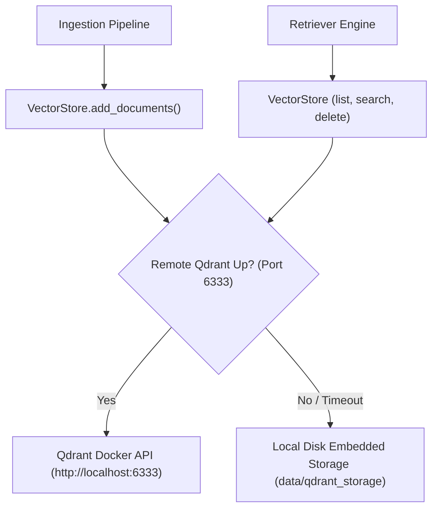

# Component Documentation: `src/components/vector_store.py`

## 1. Overview & Purpose
`src/components/vector_store.py` manages vector storage and indexing for DocuVortex using Qdrant. It features sync and async operations, batch ingestion, progress callbacks, and **automatic zero-downtime fallback** to local embedded disk storage (`data/qdrant_storage`) if the remote Qdrant Docker container on Port 6333 is unreachable.

---

## 2. Key Components & Functions

### `_is_remote_qdrant_up(url: str, timeout: float = 0.5) -> bool`
- Performs an ultra-fast socket probe to check if the remote Qdrant service is actively listening.

### `_get_local_client(storage_path="data/qdrant_storage") -> QdrantClient`
- Singleton factory providing a local file-based `QdrantClient(path=...)`.

### `VectorStore`

#### `__init__(collection_name: str | None = None)`
- Determines connection target: `QDRANT_URL` env var or `config/config.yaml`.
- Checks `self.is_remote` via `_is_remote_qdrant_up`.
- Fetches embedding models from `src.components.embedder.Embedder()`:
  - `embedding_model`: configured for query prefixing.
  - `document_embedding_model`: configured for document chunks.

#### `_client() -> QdrantClient` & `_async_client() -> AsyncQdrantClient`
- Returns remote client if reachable; automatically defaults to `_get_local_client()` on connection error.

#### `add_documents(chunks, batch_size=250, progress_callback=None, on_retry=None)`
- Adds metadata indexes to chunks: `doc_index`, `content_length`, `collection_name`.
- Batches chunk storage into sizes of 250.
- Calls `create_collection` with `Distance.COSINE` if collection does not yet exist.
- Triggers `progress_callback(count)` to notify frontend SSE / polling listeners.
- Falls back to local disk storage if remote batch indexing fails.

#### Document & Collection Introspection
- **`get_all_documents()` / `aget_all_documents()`**: Scrolls all points from the collection (without vectors for fast payload retrieval).
- **`list_collections()` / `alist_collections()`**: Lists collection names.
- **`delete_collection()` / `adelete_collection()`**: Drops collection from Qdrant and calls `invalidate_cached_db(name)` in the retriever.

---

## 3. Connections & Component Mapping

### Upstream Callers:
- `src.pipelines.ingestion_pipeline.IngestionPipeline`
- `src.components.retriever.Retriever`
- `src.routers.collections`
- `src.routers.sessions`
- `src.utils.helpers: adelete_collections, aget_available_collections`

### Downstream Dependencies:
- `qdrant_client.QdrantClient`, `AsyncQdrantClient`
- `langchain_qdrant.QdrantVectorStore`
- `src.components.embedder.Embedder`
- `src.components.retriever: invalidate_cached_db`

---

## 4. AI & Developer Guidelines
- **Automatic Fallback:** Do not panic if Qdrant Docker is not running during local development. `VectorStore` automatically uses SQLite/RocksDB embedded on disk in `data/qdrant_storage`.
- **Collection Cleanup:** When calling `delete_collection()`, always ensure you also call `MemoryManager.remove_attachment()` to keep PostgreSQL metadata synchronized.
