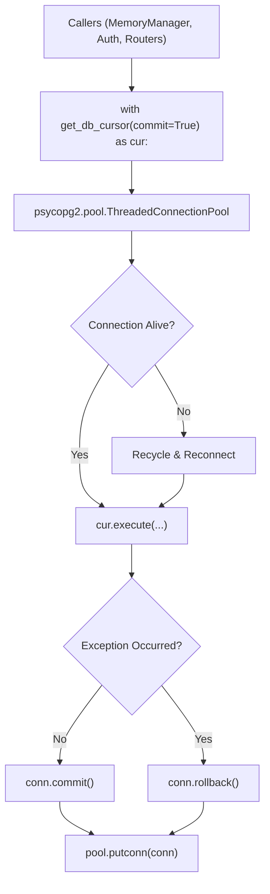

# Database Adapter Documentation: `src/database/db.py`

## 1. Overview & Purpose
`src/database/db.py` is the PostgreSQL connection pool manager and schema initialization module for DocuVortex. It maintains a `psycopg2.pool.ThreadedConnectionPool` configured with TCP keepalives for Supabase, provides a transactional context manager (`get_db_cursor`), performs health checks (`test_connection`), and executes defensive, idempotent schema migrations on application startup.

---

## 2. Key Components & Functions

### `_get_db_url() -> str`
- Resolves the connection string:
  - Prioritizes `DATABASE_URL` from `.env`.
  - Normalizes `postgres://` to `postgresql://`.
  - Automatically appends `sslmode=require` and aggressive TCP keepalives (`keepalives=1&keepalives_idle=30&keepalives_interval=10&keepalives_count=5`) when connecting to Supabase, preventing cloud idle timeouts.
  - Falls back to `config/config.yaml` (`postgres` section) if env var is missing.

### `get_pool() -> pool.ThreadedConnectionPool`
- Initializes a singleton thread-safe pool (`minconn=1`, `maxconn=10`).

### `test_connection() -> bool`
- Executes `SELECT 1 AS alive;` and logs an unambiguous status (`✅ Supabase app DB connection OK` or failure reason).

### `init_db(sql_path: str = "database/init.sql") -> None`
- Executes schema file `database/init.sql`.
- Performs granular, defensive migrations:
  - `CREATE EXTENSION IF NOT EXISTS pgcrypto;`
  - Creates and alters `users`, `user_sessions`, `sessions`, `messages`, `attachments`, `session_summaries`.
  - Inserts default `guest` account if not present.

### `get_db_cursor(commit: bool = True)` (Context Manager)
- Yields a dictionary-based cursor (`RealDictCursor`).
- Automatically handles connection checkout and checkin from the pool.
- Validates connection liveness before yielding (`SELECT 1;`). Discards and replaces dead connections silently.
- Automatically commits on clean exit, rolls back on exception, and guarantees connection return to the pool in `finally`.

---

## 3. Connections & Component Mapping

### Upstream Callers:
- `app.py`: `init_db()`, `test_connection()`.
- `src.auth`: API key hash lookups, guest user provisioning, session checks.
- `src.components.memory_manager`: Message queries, attachment records, session summaries.
- `src.routers.auth`: API key verification, session status, logout.
- `check_db.py`, `seed_user.py`, `wipe_data.py`.

### Downstream Dependencies:
- `psycopg2`, `psycopg2.pool`, `psycopg2.extras.RealDictCursor`.
- Supabase PostgreSQL remote database.

---

## 4. AI & Developer Guidelines
- **Always Use Context Manager:** Never call `pool.getconn()` directly in application logic. Always use `with get_db_cursor(commit=True) as cur:` or `with get_db_cursor(commit=False) as cur:` for read-only queries to prevent connection leaks.
