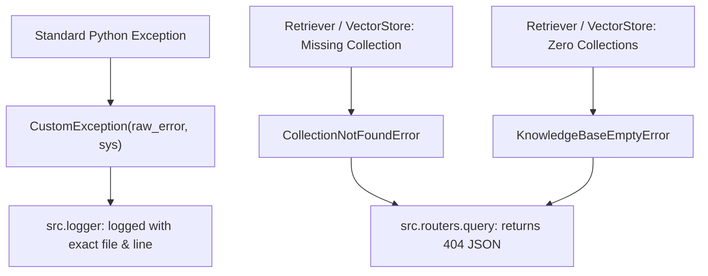

# Module Documentation: `src/exception.py`

## 1. Overview & Purpose
`src/exception.py` defines the centralized custom exception hierarchy for DocuVortex. It provides detailed stack trace inspections (extracting script name, line number, and error messages) and domain-specific errors that drive HTTP status codes and error banners in the web interface.

---

## 2. Key Components & Classes

### `error_message_detail(error, error_detail: sys) -> str`
- Inspects `sys.exc_info()` to extract the exact filename and line number where the exception originated:
  `"Error occurred in python script name [<filename>] line number [<line>] error message [<message>]"`

### `CustomException(Exception)`
- Wraps any standard Python exception with the formatted error message detail string.
- Standard across all component classes (`MemoryManager`, `VectorStore`, `DocumentLoader`, etc.).
- Alias: `DocuVortexException = CustomException`.

### `CollectionNotFoundError(Exception)`
- **Raised When:** A query is directed to one or more vector store collections that have been deleted or do not exist in Qdrant.
- **Attributes:** `missing_collections: list[str]`.
- **HTTP Mapping:** Handled in `src.routers.query` to return HTTP `404 collection_not_found`.

### `KnowledgeBaseEmptyError(Exception)`
- **Raised When:** A retrieval query is executed but the vector database contains zero documents/collections.
- **HTTP Mapping:** Handled in `src.routers.query` to prompt the user to upload a file or add a YouTube link.

---

## 3. Connections & Component Mapping

### Upstream Callers:
- Nearly every module in `src/components/`, `src/chains/`, `src/database/`, `src/pipelines/`, and `src/routers/`.

---

## 4. AI & Developer Guidelines
- Always wrap caught exceptions in `raise CustomException(e, sys)` when implementing new component functions to maintain consistent log trace formatting.
