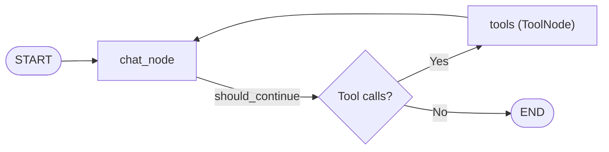

# Agent Nodes Documentation: `src/graph/agent_nodes.py`

## 1. Overview & Purpose
`src/graph/agent_nodes.py` defines the decision and execution nodes for the stateless document ReAct agent (`src.graph.agent`). It forces the LLM to call retrieval tools (`rag_query` or `summarize_document`) on the first turn to prevent general knowledge hallucinations, and handles the subsequent generation step once document context is returned.

---

## 2. Key Components & Functions

### `SYSTEM_PROMPT`
Strict instruction establishing DocuVortex's role:
- Answer **ONLY** from uploaded documents. Zero general knowledge reliance.
- If tools return no results, state: *"I couldn't find relevant information in your uploaded documents."*
- Copy citations starting with `'Source:'` exactly.

### `chat_node(state: AgentState) -> Dict[str, Any]`
- Evaluates whether the latest message is a `ToolMessage`:
  - **Turn 1 (User Query):** Forces tool invocation using `tool_choice={"type": "function", "function": {"name": forced_tool_name}}` (`summarize_document` if summary request, else `rag_query`). Injects `collection_names`, `session_id`, and `user_id` into tool arguments.
  - **Turn 2 (Tool Output Received):** Calls the LLM without tools to synthesize the grounded answer from the returned passages.

### `should_continue(state: AgentState) -> str`
- Checks whether `response.tool_calls` is present:
  - If yes, routes to `"tools"`.
  - If no, routes to `END`.

### `tools_node = ToolNode(tools=AVAILABLE_TOOLS)`
- LangGraph prebuilt tool executor.

---

## 3. Connections & Component Mapping

### Upstream Callers:
- `src.graph.agent: build_react_agent`

### Downstream Dependencies:
- `src.graph.tools: AVAILABLE_TOOLS (rag_query, summarize_document)`
- `src.chains.qa_chain: _build_llm, is_summary_request`
- `src.utils.rate_limiter: llm_rate_limiter`

---

## 4. AI & Developer Guidelines
- **Forced Tool Calling:** By binding `tool_choice` to `rag_query` or `summarize_document` on Turn 1, the model cannot hallucinate answers from its weights before inspecting documents.
