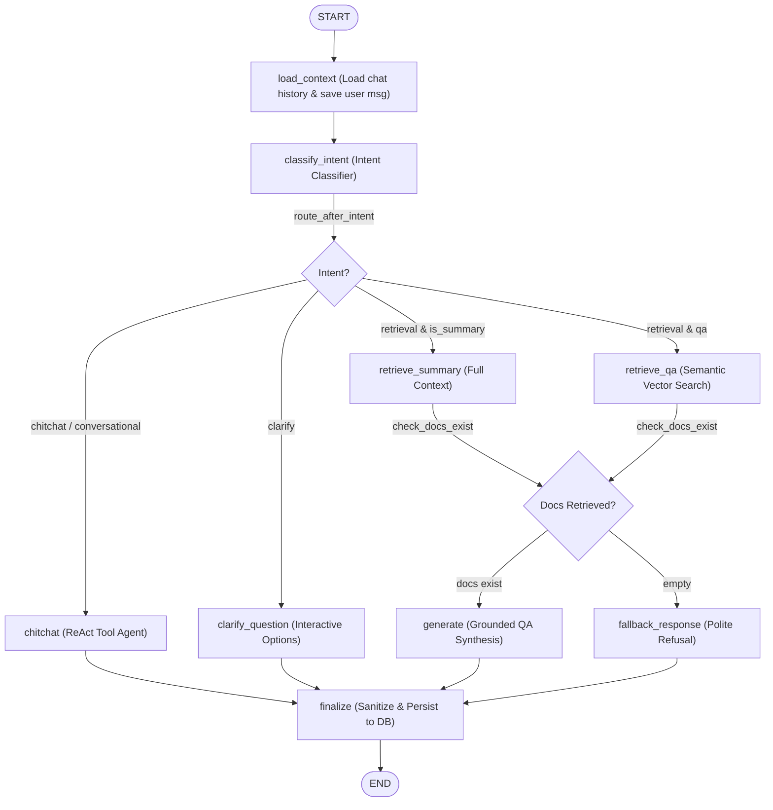

# Graph Builder Documentation: `src/graph/builder.py`

## 1. Overview & Purpose
`src/graph/builder.py` compiles the central LangGraph `StateGraph` workflow for DocuVortex. It wires together context loading, intent classification, conversational ReAct tool calling, clarification handling, document retrieval (QA vs summary), document grading, answer generation, and finalization.

---

## 2. Graph Topology & Conditional Routing

---

## 3. Key Functions & Edge Conditionals

### `route_after_intent(state: RAGState) -> str`
- Checks `state["intent"]`:
  - Returns `"chitchat"` for greetings, real-time tools (stocks, weather, web search, math).
  - Returns `"clarify_question"` for vague queries lacking concrete nouns.
  - If retrieval: returns `"retrieve_summary"` if `state["is_summary"]` is true; otherwise returns `"retrieve_qa"`.

### `check_docs_exist(state: RAGState) -> str`
- Inspects `state["docs"]`:
  - Returns `"generate"` if documents were retrieved.
  - Returns `"fallback_response"` if zero documents were found.
  - *(Note: `grade_documents` node is preserved in the graph codebase for optional re-activation).*

### `build_rag_graph(checkpointer=None)`
- Registers all 10 nodes: `load_context`, `classify_intent`, `clarify_question`, `chitchat`, `retrieve_qa`, `retrieve_summary`, `grade_documents`, `generate`, `fallback_response`, `finalize`.
- Connects static and conditional edges.
- Compiles the runnable graph with or without a checkpointer.

---

## 4. Connections & Component Mapping

- **Called By:**
  - `app.py: lifespan`: Compiles `build_rag_graph(checkpointer=checkpointer)` and attaches to `app.state.rag_graph`.
  - `src.routers.query: query`: Streams events from the compiled graph via `astream_events()`.
- **Imports From:**
  - `src.graph.nodes_agentic`: `classify_intent`, `clarify_question`, `chitchat`, `fallback_response`, `grade_documents`.
  - `src.graph.nodes.retrieve`: `load_context_node`, `retrieve_qa_node`, `retrieve_summary_node`.
  - `src.graph.nodes.generate`: `generate_node`, `finalize_node`.
  - `src.graph.state`: `RAGState`.

---

## 5. AI & Developer Guidelines
- **Modifying Node Logic:** Do not modify the compiled graph structure unless adding a new architectural stage. Most domain modifications belong inside the specific node functions in `src/graph/nodes/` or `src/graph/nodes_agentic.py`.
