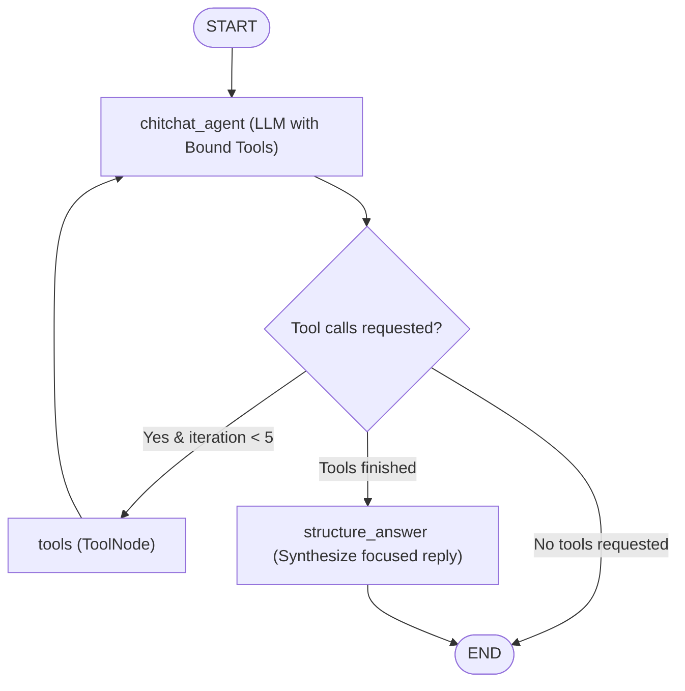

# Subgraph Documentation: `src/graph/chitchat_subgraph.py`

## 1. Overview & Purpose
`src/graph/chitchat_subgraph.py` implements a self-contained, prebuilt LangGraph tool-calling subgraph for conversational interactions. It forces strict tool dispatching for live queries (stocks, weather, math, arXiv, web search), executes tools within a safe iterative loop (capped at 5 turns), and routes tool outputs through an answer structuring node to synthesize a focused, clean final response without historical topic bleed.

---

## 2. Key Components & Subgraph Architecture

### `ChitChatState(TypedDict)`
Isolated state for the subgraph:
- **`messages`**: Sequence of `BaseMessage` with `add_messages` reducer.
- **`iteration_count`**: Counter preventing infinite tool execution loops.
- **`tools_called`**: Boolean tracking whether tools ran during this turn.

### Key Nodes
1. **`chitchat_agent_node(state)`**:
   - Injects dynamic current system date and time (`Current Date: [Dynamic System Date]`) at message index 0 (required by Groq/OpenAI APIs).
   - Evaluates queries against `TEMPORAL_PATTERNS` ("latest", "recent", "who won", "2024", "2025", "2026").
   - **Programmatic Force Search:** If a temporal query did not trigger a tool call on iteration 1, programmatically forces a call to `search_tool` with an optimized factual query (`_optimize_search_query`).
   - Invokes `_build_chitchat_tool_llm()` (Groq `openai/gpt-oss-20b` with Gemini fallbacks bound to `chitchat_tools`).
   - Increments iteration count.
2. **`chitchat_tool_node`**:
   - `ToolNode(tools=chitchat_tools, handle_tool_errors=True)`.
3. **`structure_answer_node(state)`**:
   - Isolates the current turn (ignoring past chat topics).
   - Injects dynamic current date into `_get_dynamic_response_structure_prompt()`.
   - **Anti-Hallucination & Overwrite Rule:** Instructs synthesis LLM that live search results strictly overrule frozen parametric training weights for tournament winners and chronological facts.
4. **`should_continue_chitchat(state) -> str`**:
   - Enforces loop limits: routes to `"tools"` if tool calls are present and iterations $< 5$; routes to `"structure_answer"` once tools have run; otherwise ends.

---

## 3. Connections & Component Mapping

- **Called By:** `src.graph.nodes_agentic: run_react_agent()` (which is mounted into `src.graph.builder` as the `chitchat` node).
- **Tools Bound:** `src.graph.chitchat_tools: chitchat_tools`.
- **LLM Providers:** Groq (`openai/gpt-oss-20b`, `120b`, `qwen3.8`) and Google Gemini (`gemini-3.8-flash`, `3.7-flash`).

---

## 4. AI & Developer Guidelines
- **System Message Placement:** Groq and OpenAI reject requests if a `SystemMessage` appears anywhere other than index 0. `chitchat_agent_node` and `structure_answer_node` explicitly enforce this order.
- **Single-Turn Isolation:** `structure_answer_node` deliberately slices from the last `HumanMessage` forward so prior queries (e.g. asking about weather in turn 1) do not leak into stock price inquiries in turn 2.
