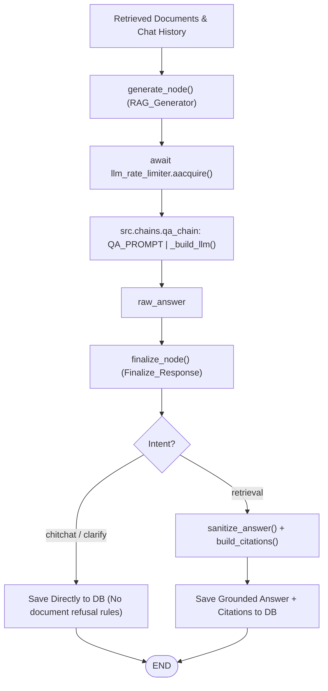

# Generation Nodes Documentation: `src/graph/nodes/generate.py`

## 1. Overview & Purpose
`src/graph/nodes/generate.py` handles the answer generation and response finalization phases of the LangGraph workflow. It constructs grounded prompts from retrieved passages, cleans chat histories to prevent refusal cascades, throttles calls against API rate limits, sanitizes raw outputs, builds deterministic citations, and persists assistant replies to PostgreSQL.

---

## 2. Key Components & Functions

### `generate_node(state: RAGState) -> Dict[str, Any]` (Traceable: `RAG_Generator`)
- **Execution Position:** Follows `retrieve_qa_node` or `retrieve_summary_node` when documents are present.
- **Process:**
  1. Formats retrieved passages into numbered notes via `format_docs(docs)`.
  2. **Balanced History Sanitization:** Calls `prepare_clean_chat_history(chat_history)` to discard `SystemMessage` objects, prune complete fallback turn pairs (preventing orphan unanswered user questions), and retain at most the last 2 completed clean turn pairs.
  3. Builds LLM with fallbacks (`_build_llm()`).
  4. Waits for token capacity using `await llm_rate_limiter.aacquire()`.
  5. Invokes generation chain: `(QA_PROMPT | llm | StrOutputParser)`.
- **Updates State With:** `{"raw_answer": raw_answer}`.

### `finalize_node(state: RAGState) -> Dict[str, Any]` (Traceable: `Finalize_Response`)
- **Execution Position:** Final node before `END`.
- **Behavior by Intent:**
  - **Conversational / Chitchat / Clarify:** Bypasses document refusal sanitizers. Directly saves response (or clarification bullet options) to PostgreSQL via `MemoryManager.asave_message("ai", ...)` and returns `{"final_answer": ..., "citations": ""}`.
  - **Document Retrieval:**
    - If `raw_answer == FALLBACK_ANSWER`, returns fallback without citations.
    - Otherwise, runs `sanitize_answer(raw_answer)` and generates citations (`build_source_only_citations` for summaries, `build_citations` for QA).
    - Appends citations block: `f"{final_answer}\n\n{citations}"`.
    - Persists finalized message to PostgreSQL.
- **Updates State With:** `{"final_answer": final_answer, "citations": citations}`.

### `fallback_node(state: RAGState) -> Dict[str, Any]`
- Standalone helper returning `FALLBACK_ANSWER`.

---

## 3. Connections & Component Mapping

### Upstream Callers:
- `src.graph.builder`: StateGraph edges.

### Downstream Dependencies:
- `src.chains.qa_chain`: `QA_PROMPT`, `_build_llm`, `format_docs`, `sanitize_answer`, `build_citations`.
- `src.components.memory_manager.MemoryManager`: `asave_message("ai", ...)`.
- `src.utils.rate_limiter: llm_rate_limiter`.

---

## 4. AI & Developer Guidelines
- **Preserve Intent Branching:** Never apply `sanitize_answer` to `chitchat` or `clarify` responses. `sanitize_answer` treats short conversational replies without document keywords as failed retrievals.
