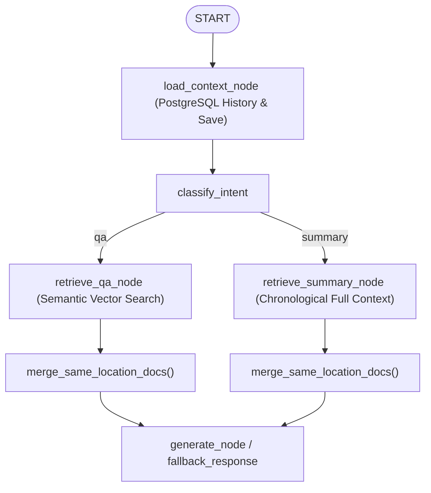

# Retrieval Nodes Documentation: `src/graph/nodes/retrieve.py`

## 1. Overview & Purpose
`src/graph/nodes/retrieve.py` contains the input context loading and knowledge retrieval nodes for the LangGraph workflow. It loads prior chat history from PostgreSQL, persists the user's incoming message, and dispatches between targeted vector search (`retrieve_qa_node`) and full-document context aggregation (`retrieve_summary_node`).

---

## 2. Key Components & Functions

### `load_context_node(state: RAGState) -> Dict[str, Any]` (Traceable: `Load_Context`)
- **Execution Position:** First node executed after `START`.
- **Actions:**
  1. Instantiates `MemoryManager(session_id, user_id)`.
  2. Fetches chat history asynchronously (`aget_history()`).
  3. Saves the incoming human query to the database (`asave_message("human", question, attachments)`).
  4. Evaluates whether the question matches a document-wide summary request (`is_summary_request(question)`).
- **Updates State With:** `{"chat_history": chat_history, "is_summary": is_summary}`.

### `retrieve_qa_node(state: RAGState) -> Dict[str, Any]` (Traceable: `Retrieve_QA`)
- **Execution Position:** Triggered when intent is retrieval and query is specific.
- **Actions:**
  1. Instantiates `Retriever(collection_names=state["collection_names"])`.
  2. Asynchronously retrieves ranked chunks via `retriever.retrieve_ranked(question)`.
  3. Deduplicates and merges chunks sharing the same page or locator with `merge_same_location_docs()`.
  4. Logs retrieved passages for manual evaluation traces.
- **Updates State With:** `{"docs": docs}` (or `{"docs": []}` on missing collection).

### `retrieve_summary_node(state: RAGState) -> Dict[str, Any]` (Traceable: `Retrieve_Summary`)
- **Execution Position:** Triggered when intent is retrieval and `is_summary` is true.
- **Actions:**
  1. Instantiates `Retriever(collection_names=state["collection_names"])`.
  2. Calls `retriever.get_full_context(max_chars=6000)` to pull all document chunks in original reading order.
  3. Merges chunks with `merge_same_location_docs()`.
- **Updates State With:** `{"docs": docs}`.

---

## 3. Connections & Component Mapping

### Upstream Callers:
- `src.graph.builder`: StateGraph edges.

### Downstream Dependencies:
- `src.components.memory_manager.MemoryManager`
- `src.components.retriever.Retriever`
- `src.chains.qa_chain: is_summary_request, merge_same_location_docs`

---

## 4. AI & Developer Guidelines
- If a collection is missing or the knowledge base is empty, both retrieval nodes catch `CollectionNotFoundError` and `KnowledgeBaseEmptyError` and safely return `{"docs": []}`, allowing the graph to route cleanly to `fallback_response` instead of throwing an unhandled 500 error.
