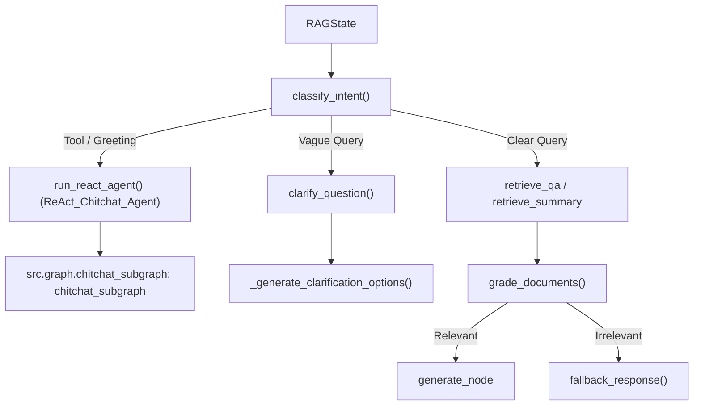

# Agentic Nodes Documentation: `src/graph/nodes_agentic.py`

## 1. Overview & Purpose
`src/graph/nodes_agentic.py` encapsulates the decision-making nodes for intent routing, query clarity evaluation, interactive clarification option generation, conversational ReAct tool execution, document grading, and fallback responses.

---

## 2. Key Components & Functions

### `classify_intent(state: RAGState) -> Dict[str, Any]` (Traceable: `Intent_Classifier`)
Determines the routing path:
1. **Tool & Chitchat Regex Matching:** Matches explicit queries for stock prices (`aapl`, `tsla`, `mahindra`, `nifty`), weather (`weather in london`), math (`230*460`), academic research (`search arxiv`), live news & sports tournaments/winners (`who won`, `world cup`, `champions trophy`, `ipl`, `fifa`, `icc`, `t20`), or greetings (`hello`, `who are you`) -> Routes to `'chitchat'`.
2. **Document Check:** If document sources are attached to the session:
   - Evaluates clarity with `check_query_clarity()`.
   - If vague, routes to `'clarify'` (with anti-loop guard: never clarifies twice consecutively).
   - If clear, routes to `'retrieval'`.
3. **No Document Attached:** If no file or video is active in this session, routes directly to `'chitchat'`.

### `check_query_clarity(question: str, chat_history: list = None) -> tuple[bool, str]`
- Evaluates whether the question specifies a clear concept or topic.
- Checks against standalone vague nouns (`AMBIGUOUS_STANDALONE_NOUNS`: "method", "model", "result", "algorithm", "chapter").
- Spelling tolerance: Queries with 4+ words and at least 1 meaningful non-stopword term are treated as clear.

### `clarify_question(state: RAGState) -> Dict[str, Any]` (Traceable: `Clarify_Question`)
- Formats structured clarification JSON containing a helpful explanation and 3-4 clickable refined question suggestions (`_generate_clarification_options`).

### `run_react_agent(state: RAGState) -> Dict[str, Any]` (Traceable: `ReAct_Chitchat_Agent`)
- Invokes the compiled tool-calling subgraph (`src.graph.chitchat_subgraph:chitchat_subgraph`).
- Includes direct resilient fallback execution for stocks, weather, and web search if the agent subgraph encounters an exception.
- Aliases: `chitchat`, `run_chitchat`.

### `grade_documents(state: RAGState) -> Dict[str, Any]` (Traceable: `Document_Grader`)
- Inspects retrieved chunks and asks a fast Flash model if the passages contain relevant information to answer the question (`'yes'` -> `'relevant'`, `'no'` -> `'irrelevant'`).
- Degrades gracefully on any error or 429 quota limit, marking chunks as `'relevant'`.

### `fallback_response(state: RAGState) -> Dict[str, Any]`
- Returns `FALLBACK_ANSWER` when retrieved documents are irrelevant or empty.

---

## 3. Connections & Component Mapping

### Upstream Callers:
- `src.graph.builder.build_rag_graph`

### Downstream Dependencies:
- `src.graph.chitchat_subgraph.chitchat_subgraph`
- `src.graph.tools: get_stock_price, get_weather, search_tool, search_arxiv, calculator`
- `src.chains.qa_chain: FALLBACK_ANSWER, is_summary_request`

---

## 4. AI & Developer Guidelines
- **Anti-Loop Clarification Guard:** If a user answers a clarification prompt, `_was_last_response_clarification()` detects this and forces routing to retrieval so the agent never gets stuck in a clarification loop.
