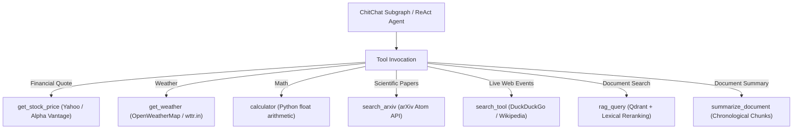

# Agent Tools Documentation: `src/graph/tools.py`

## 1. Overview & Purpose
`src/graph/tools.py` contains the complete tool definitions for both document-grounded retrieval and real-time live tools. It provides tools for document searching (`rag_query`), document summarization (`summarize_document`), live financial stock quotes (`get_stock_price`), global weather forecasts (`get_weather`), arithmetic evaluation (`calculator`), academic preprint searches (`search_arxiv`), and web search (`search_tool`).

---

## 2. Key Tools & Interfaces

### Document-Grounded Tools
1. **`rag_query(query: str, collection_names: Optional[List[str]], ...) -> str`**
   - Performs vector retrieval and lexical re-ranking across scoped collections.
   - Returns formatted source passages with citations.
2. **`summarize_document(collection_names: Optional[List[str]], ...) -> str`**
   - Retrieves full document context in chronological order up to `summary_max_chars`.

### Conversational / Real-Time Live Tools (`chitchat_tools`)
3. **`get_stock_price(symbol: str, ticker: str, company: str) -> dict`**
   - **Coverage:** Global and Indian equities (NSE/BSE), indices (Nifty, Sensex, S&P500), and crypto (Bitcoin, Ethereum).
   - **Resolution:** Resolves company names to standard tickers using `TICKER_MAP` (e.g. `"Mahindra"` -> `M&M.NS`, `"Tata Motors"` -> `TATAMOTORS.NS`) and Yahoo Finance dynamic search.
   - **Multi-API Fallback:** Queries Yahoo Finance Chart API -> Alpha Vantage API -> DuckDuckGo real-time finance snippets.
   - Returns price, currency, daily change, day high/low, and exchange.

4. **`get_weather(location: str, city: str) -> str`**
   - **Coverage:** Global weather by city name.
   - **Multi-API Fallback:** OpenWeatherMap API (if key configured) -> `wttr.in` JSON API (free, reliable worldwide).
   - Returns temperature (°C), feels-like, weather condition description, humidity, and wind speed.

5. **`calculator(first_num: float, second_num: float, operation: str) -> dict`**
   - Performs exact arithmetic: `add`, `sub`, `mul`, `div`. Handles division by zero safely.

6. **`search_arxiv(query: str, max_results: int = 3) -> str`**
   - Queries the official arXiv Atom XML API for scientific preprints.
   - Returns formatted paper titles, links, and abstracts.

7. **`search_tool(query: str) -> str`**
   - General web search using `duckduckgo_search` library (with `api`, `html`, and `lite` backend fallbacks) -> `langchain_community.tools.DuckDuckGoSearchResults` -> Wikipedia REST API fallback.

---

## 3. Connections & Component Mapping

### Upstream Callers:
- `src.graph.chitchat_subgraph: build_chitchat_subgraph` (mounts `chitchat_tools`).
- `src.graph.agent_nodes: AVAILABLE_TOOLS` (mounts `rag_query`, `summarize_document`).
- `src.routers.query: event_generator` (emits status events based on tool names).

---

## 4. AI & Developer Guidelines
- **Strict Separation Rules:** Never use `search_tool` for stock prices, weather, or math. Each domain has a dedicated deterministic tool (`get_stock_price`, `get_weather`, `calculator`).
- **Resilience:** All tools implement internal try/except fallbacks so external API outages never crash the StateGraph.
