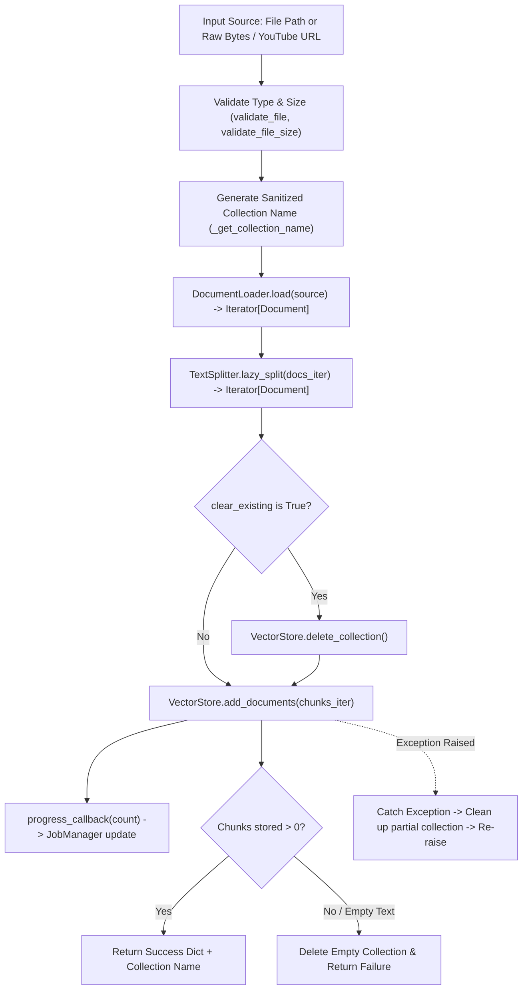

# Pipeline Documentation: `src/pipelines/ingestion_pipeline.py`

## 1. Overview & Purpose
`src/pipelines/ingestion_pipeline.py` orchestrates the complete document and media ingestion process. It streams files through the loader, splitter, and vector database, generates deterministic collection names, validates formats and sizes, handles progress updates, and rolls back partially indexed data if an error occurs.

---

## 2. Ingestion Flow Architecture



---

## 3. Key Components & Functions

### `IngestionPipeline`

#### `__init__()`
- Instantiates `DocumentLoader` and `TextSplitter`.

#### `run(source, collection_name=None, clear_existing=True, on_retry=None, progress_callback=None) -> dict`
- **Execution:**
  1. Generates or normalizes `collection_name`.
  2. Lazily streams documents from loader to splitter:
     ```python
     docs_iter = self.loader.load(source)
     chunks_iter = self.splitter.lazy_split(docs_iter)
     ```
  3. Deletes existing collection if `clear_existing` is true.
  4. Ingests chunks into Qdrant via `VectorStore.add_documents`.
  5. **Rollback Safety:** If ingestion fails midway, automatically deletes the partial collection so corrupted or incomplete data is never left orphaned in Qdrant.
  6. Returns dictionary: `{"success": True, "source": ..., "collection_name": ..., "chunks_stored": ...}`.

#### `run_from_bytes(file_bytes, filename, ...) -> dict`
- Validates file type and size.
- Temporarily saves bytes to `data/uploads/` via `save_uploaded_file()`.
- Executes `run()`.
- Guarantees temporary file deletion in a `finally` block via `delete_file_after_processing(file_path)`.

#### `_get_collection_name(source: str) -> str`
- For YouTube URLs: returns `youtube_<video_id>`.
- For files: sanitizes the filename into a safe alphanumeric string (`doc_<name>_<hash>`).

---

## 4. Connections & Component Mapping

### Upstream Callers:
- `src.routers.upload: _run_upload_job` (background worker).
- `src.routers.youtube: _run_youtube_job` (background worker).

### Downstream Dependencies:
- `src.components.document_loader.DocumentLoader`
- `src.components.text_splitter.TextSplitter`
- `src.components.vector_store.VectorStore`
- `src.utils.file_helper: validate_file, validate_file_size, save_uploaded_file, delete_file_after_processing`
- `src.utils.youtube_helper: is_youtube_url, extract_video_id`

---

## 5. AI & Developer Guidelines
- **Zero Disk Leakage:** All file bytes saved during `run_from_bytes()` are strictly wiped from the local filesystem inside the `finally` block once indexing completes.
