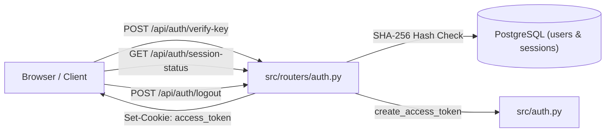

# Router Documentation: `src/routers/auth.py`

## 1. Overview & Purpose
`src/routers/auth.py` exposes REST endpoints under the `/api/auth` prefix for user authentication and session management. Authentication is powered entirely by **API keys** generated via `seed_user.py` (or the guest fallback). Legacy math captchas, username/password forms, and password retrieval routes have been removed.

---

## 2. Endpoints & Route Definitions

### `POST /api/auth/verify-key`
- **Request Body:** `VerifyKeyRequest` (`{"api_key": "dk_live_..."}`)
- **Purpose:** Validates the API key entered in the UI modal or provided programmatically.
- **Logic:**
  1. If `api_key == "guest"`, issues a 30-day session token for the static guest user (`00000000-0000-0000-0000-000000000001`).
  2. Computes the SHA-256 hash of the presented key.
  3. Queries PostgreSQL `users` table where `api_key_hash = %s`.
  4. If found, fetches the user's most recent chat `session_id` from `sessions` (so the UI can restore previous history).
  5. Sets a 30-day HTTP-only `access_token` cookie and returns user details.
- **Response Example:**
  ```json
  {
    "valid": true,
    "user": {
      "id": "c8d0a0b1-...",
      "username": "arpit",
      "email": "arpit@docuvortex.local"
    },
    "last_session_id": "session-1234-abcd"
  }
  ```

### `GET /api/auth/session-status`
- **Headers / Query:** `X-API-Key` or `?api_key=`
- **Cookies:** `access_token`
- **Purpose:** Verifies whether the current client is authenticated and retrieves profile and last active chat session.
- **Logic:**
  1. Checks `X-API-Key` header first (queries `users.api_key_hash`).
  2. If absent, decodes the `access_token` cookie / bearer JWT.
  3. Returns `{"authenticated": false}` if unauthenticated, or the user profile and `last_session_id`.

### `POST /api/auth/logout`
- **Purpose:** Clears session record from `user_sessions` and deletes the `access_token` cookie, returning a redirect instruction to `/`.

---

## 3. Connections & Component Mapping



- **Mounted In:** `app.py: app.include_router(auth_router)`.
- **Interacts With:** `src.auth` (token creation/decoding, session expiry), `src.database.db: get_db_cursor`.
- **Frontend Clients:** `templates/static/js/app_new.js` (`ensureApiKey()`, `openApiKeyModal()`, API headers).

---

## 4. AI & Developer Guidelines
- **API Key Format:** Valid API keys match `dk_live_<48-hex-chars>`. They are generated by running `python seed_user.py <username>`.
- **Security:** Keys are never stored in plaintext in the database; only SHA-256 digests are stored in `users.api_key_hash`.
