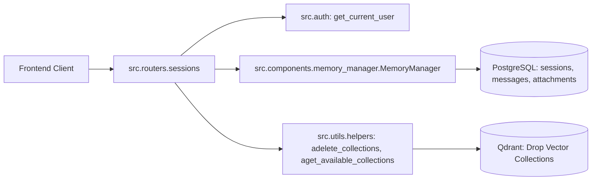

# Router Documentation: `src/routers/sessions.py`

## 1. Overview & Purpose
`src/routers/sessions.py` manages the lifecycle of multi-turn chat sessions and workspace memory. It exposes endpoints to create new sessions, list active sessions, retrieve conversation histories and attached documents, delete specific chats, remove individual attachments, and flush user memory.

---

## 2. Endpoints & Route Definitions

### `POST /sessions` & `POST /sessions/new`
- **Purpose:** Generates a new 8-character unique session ID.
- **Response:** `{"session_id": "c4d29e1f"}`.

### `GET /sessions`
- **Purpose:** Lists all sessions belonging to the authenticated user.
- **Behavior:** Automatically prunes attachments whose collections no longer exist in Qdrant, updates titles, and returns active sessions sorted by `last_active`.
- **Response:** `{"sessions": [{"session_id": "...", "title": "...", "message_count": 4, "attachment_count": 1, "last_active_label": "Oct 12, 14:30"}, ...]}`.

### `GET /sessions/{session_id}`
- **Purpose:** Returns the complete message payload, attachment list, and resolved title for a specific session.

### `DELETE /sessions/{session_id}`
- **Purpose:** Deletes a specific chat session, drops its bound collections from Qdrant, and deletes records from PostgreSQL.

### `DELETE /sessions/{session_id}/attachments/{collection_name}`
- **Purpose:** Removes an individual document or video attachment from a session, drops its Qdrant collection, and flushes retriever caches.

### `DELETE /sessions` & `DELETE /memory`
- **Purpose:** Wipes all chat sessions, messages, summaries, and associated collections for the calling user, and clears temporary uploads.

---

## 3. Connections & Component Mapping

### Upstream Callers:
- `templates/static/js/app_new.js`: Calls `/sessions` on load, `/sessions/new` on new chat click, `/sessions/{id}` on chat switch, and attachment deletion endpoints.

### Downstream Dependencies:
- `src.components.memory_manager.MemoryManager`
- `src.utils.helpers: adelete_collections, aget_available_collections, create_session_id`
- `src.utils.file_helper: clean_uploads`

---

## 4. AI & Developer Guidelines
- All operations require `user_id` via `Depends(get_current_user)`, ensuring users can only read or delete their own sessions and collections.
