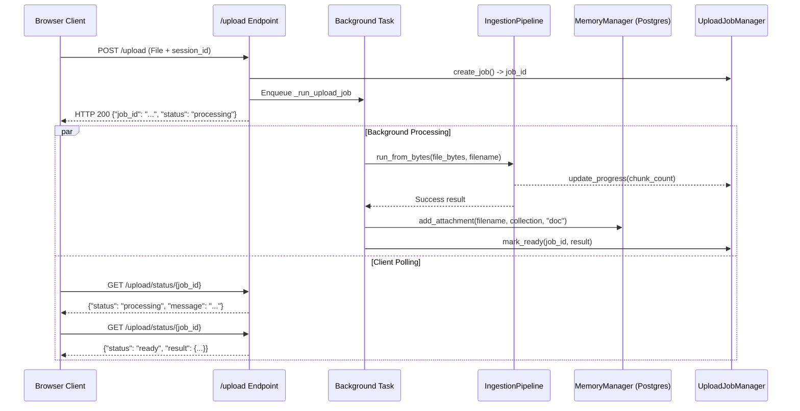

# Router Documentation: `src/routers/upload.py`

## 1. Overview & Purpose
`src/routers/upload.py` manages document file uploads for DocuVortex. It accepts multipart files via `POST /upload`, performs validation, returns an immediate job identifier to prevent client HTTP timeouts on large documents, processes ingestion asynchronously in FastAPI `BackgroundTasks`, records progress, binds the indexed collection to the user's session in PostgreSQL, and serves polling updates via `GET /upload/status/{job_id}`.

---

## 2. Endpoints & Background Processing

### `POST /upload`
- **Form Data:** `file: UploadFile`, `session_id: str`.
- **Authentication:** `Depends(get_current_user)`.
- **Validation:**
  - `validate_file`: Verifies extension against `.pdf`, `.txt`, `.docx`, `.csv`, `.md`, `.xlsx`.
  - `validate_file_size`: Caps file size at 100MB.
- **Workflow:**
  1. Generates unique collection name (`build_collection_name(file.filename, prefix="doc")`).
  2. Creates in-memory job tracker (`job_id = upload_job_manager.create_job()`).
  3. Dispatches `_run_upload_job` to `BackgroundTasks`.
  4. Returns immediate response: `{"job_id": job_id, "status": "processing"}`.

### `_run_upload_job(...)` (Background Worker)
- Runs `IngestionPipeline().run_from_bytes(...)`.
- Passes `progress_callback` to update `upload_job_manager` with chunk counts.
- On success:
  - Binds collection to session via `MemoryManager.add_attachment(name, collection, source_type="doc")`.
  - Marks job as `READY` in `upload_job_manager`.
- On failure:
  - Marks job as `FAILED` with user-friendly error description.

### `GET /upload/status/{job_id}`
- **Purpose:** Polled by frontend client during upload processing.
- **Response:**
  - Processing: `{"status": "processing", "message": "Processing document... Embedded and stored 45 chunks so far."}`
  - Ready: `{"status": "ready", "result": {"collection_name": "...", "chunks_stored": 82}}`
  - Failed: `{"status": "failed", "error": "..."}`

---

## 3. Connections & Component Mapping

### Upstream Callers:
- `templates/static/js/app_new.js: uploadFile()`.

### Downstream Dependencies:
- `src.pipelines.ingestion_pipeline.IngestionPipeline`
- `src.components.memory_manager.MemoryManager`
- `src.utils.job_manager.upload_job_manager`
- `src.utils.file_helper: validate_file, validate_file_size`
- `src.utils.helpers: build_collection_name`

---

## 4. AI & Developer Guidelines
- **Immediate Response Pattern:** Never block the `POST /upload` endpoint on embedding or vector storage. Always offload processing to `BackgroundTasks` and use `UploadJobManager` for status reporting.
