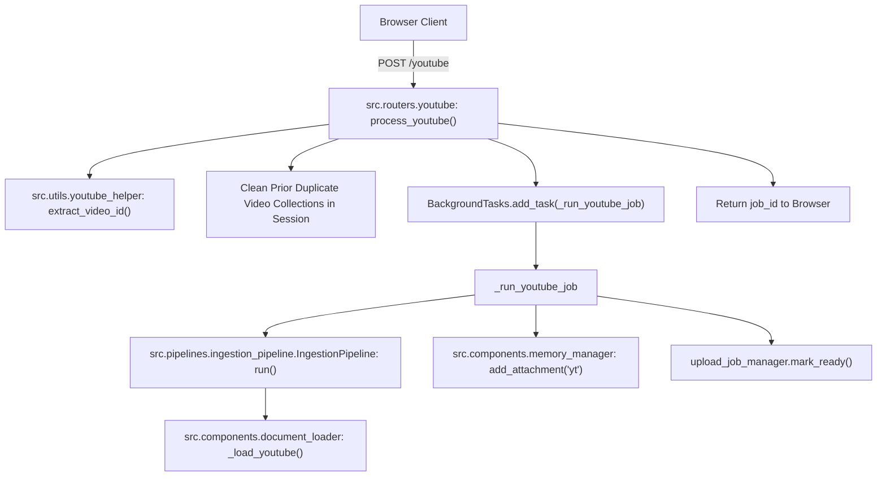

# Router Documentation: `src/routers/youtube.py`

## 1. Overview & Purpose
`src/routers/youtube.py` handles YouTube URL ingestion. It extracts canonical video IDs, purges duplicate collections for the same video within the session, launches asynchronous transcript ingestion in `BackgroundTasks`, binds transcript collections to the chat session in PostgreSQL, and reports status via `upload_job_manager`.

---

## 2. Endpoints & Route Definitions

### `POST /youtube`
- **Body:** `src.schemas.YouTubeRequest` (`url`, `session_id`, `collection_name`).
- **Authentication:** `Depends(get_current_user)`.
- **Workflow:**
  1. Validates and extracts canonical video ID via `src.utils.youtube_helper:extract_video_id`.
  2. **Deduplication Check:** If the same video was previously added to this session, drops the existing collection from Qdrant and removes old attachment records.
  3. Creates an in-memory job tracker via `upload_job_manager.create_job()`.
  4. Dispatches `_run_youtube_job` to `BackgroundTasks`.
  5. Returns immediate response: `{"job_id": job_id, "status": "processing", "video_id": video_id}`.

### `_run_youtube_job(...)` (Background Worker)
- Calls `IngestionPipeline().run(url, collection_name=...)`.
- Tracks progress and embedding count updates.
- Binds collection to session via `MemoryManager.add_attachment(name=f"YouTube {video_id}", collection=..., source_type="yt", extra={"video_id": ..., "url": ...})`.
- Marks job as `READY` in `upload_job_manager`.

---

## 3. Connections & Component Mapping

### Upstream Callers:
- `templates/static/js/app_new.js: addYouTubeSource()`.

### Downstream Dependencies:
- `src.pipelines.ingestion_pipeline.IngestionPipeline`
- `src.components.memory_manager.MemoryManager`
- `src.utils.job_manager.upload_job_manager`
- `src.utils.youtube_helper: extract_video_id`
- `src.utils.helpers: build_collection_name, delete_collections`

---

## 4. AI & Developer Guidelines
- Status polling uses the same endpoint as document uploads: `GET /upload/status/{job_id}`.
