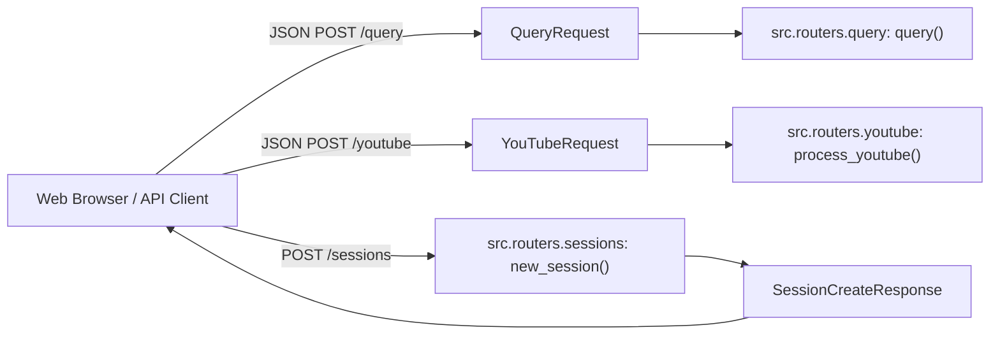

# Module Documentation: `src/schemas.py`

## 1. Overview & Purpose
`src/schemas.py` defines the Pydantic data validation schemas for incoming HTTP requests and structured JSON responses across DocuVortex API endpoints.

---

## 2. Key Schemas & Models

### `QueryRequest(BaseModel)`
User question and scope payload submitted to `/query`:
- **`query`** (`str`): The raw text prompt or question.
- **`collection_name`** (`Optional[str]`): Legacy single collection target.
- **`collection_names`** (`Optional[List[str]]`): List of active document collections to scope retrieval across.
- **`message_attachments`** (`Optional[List[dict]]`): Active file or video metadata attached to this turn.
- **`session_id`** (`Optional[str] = "default"`): Target session ID for memory persistence.

### `YouTubeRequest(BaseModel)`
YouTube URL processing payload submitted to `/youtube`:
- **`url`** (`str`): Standard YouTube video URL (e.g. `https://youtube.com/watch?v=...` or `https://youtu.be/...`).
- **`session_id`** (`Optional[str] = "default"`): Target chat session ID.
- **`collection_name`** (`Optional[str]`): Optional explicit collection name override.

### `SessionCreateResponse(BaseModel)`
Payload returned by `POST /sessions` and `POST /sessions/new`:
- **`session_id`** (`str`): Unique 8-character session identifier (e.g. `a3f89b1c`).

---

## 3. Connections & Component Mapping

### Upstream Callers:
- `src.routers.query`
- `src.routers.youtube`
- `src.routers.sessions`
- `src.utils.helpers: normalize_collection_scope`

---

## 4. AI & Developer Guidelines
- When adding new parameters to the chat interface (e.g., custom prompt overrides or temperature knobs), declare them here with default values so existing clients remain backward-compatible.
