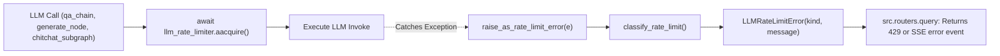

# Utility Documentation: `src/utils/rate_limiter.py`

## 1. Overview & Purpose
`src/utils/rate_limiter.py` provides proactive sliding-window rate limiting and reactive error classification for external LLM API requests (Groq and Google Gemini). It prevents `429 Too Many Requests` errors by enforcing a requests-per-minute ceiling, and catches unexpected quota rejections to translate them into clear, actionable notifications.

---

## 2. Key Components & Functions

### `RateLimiter`
Sliding-window limiter supporting both sync and async token acquisition:
- **`acquire(weight=1)`**: Synchronously checks call timestamps within `per_seconds` window. Sleeps if capacity is reached.
- **`aacquire(weight=1)`**: Asynchronously waits for capacity without blocking the FastAPI event loop.

### `llm_rate_limiter`
- Global instance initialized with `max_requests_per_minute` (default 25 requests per 60 seconds).

### `LLMRateLimitError(Exception)`
- Custom exception carrying `kind` (`"rpm"`, `"tpm"`, `"rpd"`, `"tpd"`) and `message`.

### `is_rate_limit_error(error: Exception) -> bool`
- Inspects exception text for markers: `"rate limit"`, `"resource_exhausted"`, `"quota"`, `"429"`, `"too many requests"`.

### `classify_rate_limit(error: Exception) -> str`
- Categorizes error into specific quota types:
  - `rpd`: Daily request quota reached.
  - `tpd`: Daily token limit reached.
  - `tpm`: Tokens-per-minute limit reached.
  - `rpm`: Requests-per-minute limit reached.

### `raise_as_rate_limit_error(error: Exception)`
- Backstop helper: if an exception is identified as a rate-limit error, raises `LLMRateLimitError` with the matching message from `config.yaml`. Any other error is re-raised unchanged.

---

## 3. Connections & Component Mapping

### Upstream Callers:
- `src.chains.qa_chain: get_answer, _summarize_messages`
- `src.graph.nodes.generate: generate_node`
- `src.graph.chitchat_subgraph: chitchat_agent_node, structure_answer_node`
- `src.routers.query: query`

---

## 4. AI & Developer Guidelines
- **Always Acquire Before Calling LLMs:** Always call `await llm_rate_limiter.aacquire()` before calling `llm.ainvoke()` to keep the application within free-tier provider rate limits.
