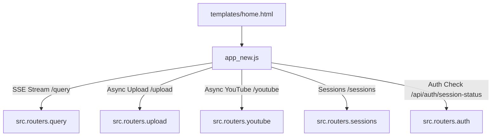

# Frontend Script Documentation: `templates/static/js/app_new.js`

## 1. Overview & Purpose
`templates/static/js/app_new.js` is the core client-side controller for the DocuVortex workspace. It manages isolated UI state (`workspaceState`, `conversationState`, `sidebarState`), parses Server-Sent Events (SSE) from `/query`, drives smooth typewriter text animations, handles file and YouTube uploads, manages chat sessions, renders dynamic tool badges (Stock, Weather, Search, Math, arXiv), and controls modal popups.

---

## 2. State Model & Isolation

The script strictly separates concerns into three isolated state objects:
1. **`workspaceState`**:
   - `sessionId`: Currently active session UUID.
   - `sources`: Attached documents/videos for this session (`localId`, `name`, `collection`, `type`, `status`).
2. **`conversationState`**:
   - `isLoading`: Boolean tracking active query generation.
   - `uploadInProgress`: Boolean tracking active background uploads.
3. **`sidebarState`**:
   - `chats`: List of prior sessions loaded from `/sessions`.
   - `searchQuery`: Filter string for searching past chats.
   - `deletingIds`: Set of session IDs undergoing deletion.

---

## 3. Key Components & Functions

### Boot & Authentication
- **`DOMContentLoaded`**: Binds UI listeners, verifies API key via `ensureApiKey()`, and calls `bootApp()`.
- **`ensureApiKey()`**: Checks `localStorage` for `docuvortex.apiKey`. Validates key against `/api/auth/session-status`. If missing or invalid, presents the API key modal.
- **`bootApp()`**: Restores the user's `last_session_id` or creates a fresh session, renders the sidebar, and updates the attachment list.

### Query Submission & SSE Streaming (`streamQuery`)
- Sends `POST /query` with `QueryRequest` JSON.
- Reads chunked SSE stream via `response.body.getReader()`:
  - **`type: "status"`**: Displays animated thinking pills ("Analyzing query...", "Retrieving context...").
  - **`type: "tool_status"`**: Renders interactive status badges (e.g. `📈 Fetching stock price for TSLA...`, `🌤️ Checking weather in Mumbai...`).
  - **`type: "token"`**: Appends tokens to the active AI message bubble with smooth auto-scroll.
  - **`type: "clarification"`**: Renders clickable question option chips that populate the composer on click.
  - **`type: "done"`**: Re-renders markdown formatting (bold, code blocks, lists) and refreshes session list in the sidebar.

### Ingestion & Polling (`uploadFile`, `addYouTubeSource`)
- Submits file to `/upload` or URL to `/youtube`.
- Receives immediate `job_id`.
- Initiates polling against `/upload/status/{job_id}`:
  - Displays chunk embedding progress.
  - Once `ready`, marks the attachment badge as ready and adds it to the composer's context menu.

### Session Management
- **`createNewChat()`**: Calls `POST /sessions` and resets the message container.
- **`loadSession(sessionId)`**: Calls `GET /sessions/{id}`, renders prior messages and attachments, and updates URL hash.
- **`deleteSession(sessionId)`**: Calls `DELETE /sessions/{id}` and updates sidebar with optimistic removal.

---

## 4. Connections & Component Mapping

---

## 5. AI & Developer Guidelines
- **Zero Framework Dependency:** Written in vanilla ES6+ JavaScript. No npm build step, webpack, or node modules required.
- **Token Typewriter Timing:** The SSE parser buffers tokens and applies dynamic delays to emulate realistic human typing speeds.
