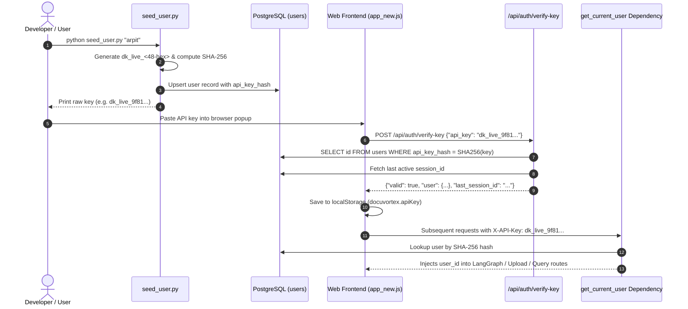

# 🛠️ System Refactor Walkthrough & GitIgnore Mapping

**Date:** September 30, 2026  
**Project:** DocuVortex (`arpitkanani/RAG-Project_DocMind`)  
**Scope:** Authentication Simplification (API Key Only), Documentation Synchronization, GitIgnore Audit, and GitHub README Modernization.

---

## 1. Executive Summary

This refactoring streamlines DocuVortex's authentication system to a **pure API-key-first architecture**, eliminating legacy and unused authentication paths while strictly preserving the current, operational API key generation and validation flow.

### Key Objectives Accomplished:
1. **Simplified Authentication:** Removed all unused math captcha challenges, username/password login forms, and password recovery routines from `src/auth.py` and `src/routers/auth.py`.
2. **Preserved Working Flow:** Verified that the API key generation (`seed_user.py`), modal validation (`app_new.js`), backend verification (`/api/auth/verify-key`), and request dependency injection (`get_current_user`) remain 100% operational without regression.
3. **Database Schema Optimization:** Removed deprecated `password_hash` column definitions from `database/init.sql` and `src/database/db.py`.
4. **Documentation Synchronization:** Updated all architectural markdown documents in `MD-FILES/` to mirror the streamlined codebase.
5. **GitHub README Overhaul:** Replaced the minimal 10-line root `README.md` with an industry-standard, badge-equipped, diagram-rich project documentation file.
6. **GitIgnore Audit & Mapping:** Fixed critical `.gitignore` flaws (where `MD-FILES/`, `seed_user.py`, and `database/` were mistakenly ignored) and organized the file with strict, deduplicated classification rules.

---

## 2. Detailed Code Changes & File Diff Breakdown

### A. `src/auth.py`
- **Removed Deprecated Functions:**
  - `hash_password(password)`: HMAC-SHA256 password hashing.
  - `verify_password(plain, hashed)`: Password comparison routine.
  - `generate_captcha()`: Random math challenge generator.
  - `verify_captcha(user_answer, token)`: Math captcha HMAC signature verifier.
- **Retained Core Components (Zero Regression):**
  - `hash_token(token)`: Session token hashing.
  - `create_access_token(...)`: Issues 30-day signed tokens (JWT with HMAC fallback).
  - `decode_access_token(token)`: Validates JWT or signed fallback tokens.
  - `_verify_user_exists(user_id)`: Validates user records in PostgreSQL.
  - `_ensure_guest_user()`: Defensively provisions the guest user (`00000000-0000-0000-0000-000000000001`).
  - `_lookup_api_key_user(api_key_hash)`: Queries `users` by SHA-256 digest.
  - `_lookup_session(user_id, session_id)`: Verifies active sessions and updates `last_seen_at`.
  - `get_current_user(...)`: Primary FastAPI dependency resolving user IDs via `X-API-Key` / `?api_key=`, cookie JWT, or guest fallback.

### B. `src/routers/auth.py`
- **Removed Deprecated Routes & Schemas:**
  - `class LoginRequest` and `class ForgotPasswordRequest`.
  - `GET /api/auth/captcha`: Endpoint returning math questions.
  - `POST /api/auth/forgot-password`: Plaintext password retrieval.
  - `POST /api/auth/login` and `POST /api/auth/authenticate`: Password + captcha form submission.
- **Retained Endpoints (Active API Key Flow):**
  - `POST /api/auth/verify-key`: Accepts `VerifyKeyRequest({"api_key": "..."})`, validates the SHA-256 hash in PostgreSQL, retrieves the user's `last_session_id`, sets a 30-day HTTP-only `access_token` cookie, and returns the user profile.
  - `GET /api/auth/session-status`: Resolves the current user identity via `X-API-Key` or session cookie and returns authentication status.
  - `POST /api/auth/logout`: Clears the session record from `user_sessions` and deletes the cookie.

### C. `database/init.sql` & `src/database/db.py`
- Removed `password_hash TEXT` column definition from the initial `CREATE TABLE IF NOT EXISTS users` DDL in `database/init.sql`.
- Removed `password_hash` column addition from the automated, defensive migration routines in `src/database/db.py`.

### D. Documentation in `MD-FILES/`
- **`MD-FILES/src/auth.md`:** Updated component listing and caller references to explain the API key hashing and guest user model.
- **`MD-FILES/src/routers/auth.md`:** Streamlined endpoint documentation to reflect `/verify-key`, `/session-status`, and `/logout`.
- **`MD-FILES/database/init.md`:** Updated Entity-Relationship Diagram (ERD) and table schema descriptions.
- **`MD-FILES/src/database/db.md`:** Updated caller references to reflect API key verification.
- **`MD-FILES/README.md`:** Synchronized the documentation index summary.

### E. Root `README.md`
- Replaced the placeholder README with an industry-standard open-source document featuring:
  - Tech stack badges (Python, FastAPI, LangChain, LangGraph, Qdrant, Supabase).
  - System architecture diagram (Mermaid).
  - Step-by-step setup and virtual environment guide.
  - Clear instructions on generating and using API keys with `seed_user.py`.
  - Complete REST API endpoint reference table.

---

## 3. How API Key Authentication Works (Integrity Verification)

The API key authentication mechanism was strictly preserved and operates across four synchronized layers:

1. **Generation:** `seed_user.py` creates a random 24-byte hex key prefixed with `dk_live_`. The raw key is displayed to the user once, and only its SHA-256 hash is stored in `users.api_key_hash`.
2. **Frontend Storage:** The frontend (`templates/static/js/app_new.js`) stores the key in browser `localStorage` (`docuvortex.apiKey`).
3. **Session Reconnection:** When the key is verified, the server returns the user's `last_session_id`, allowing the UI to instantly restore previous chat messages and document attachments.
4. **Request Authentication:** All subsequent API requests attach the `X-API-Key` HTTP header. The FastAPI dependency `get_current_user` in `src/auth.py` hashes the key, matches it against `users.api_key_hash`, and injects the verified `user_id` into all downstream routers (`/query`, `/upload`, `/youtube`, `/sessions`).
5. **Guest Mode Fallback:** If a user chooses "Continue as Guest" or provides the key `"guest"`, the system routes them to the static guest user UUID (`00000000-0000-0000-0000-000000000001`), ensuring that document exploration works without mandatory account creation.

---

## 4. GitIgnore Mapping & Audit

### Why the Previous `.gitignore` Had Issues:
- **Critical File Blockage:** The old `.gitignore` contained `MD-FILES` (blocking all markdown system documentation), `seed_user.py` (blocking the primary API key tool), and `database/` (blocking PostgreSQL schema files).
- **Redundancy & Duplication:** `.env` appeared 3 times, `test.csv` appeared 4 times, `endpoint_regression_check.py` appeared 3 times, and `requirements1.txt` appeared 2 times.
- **Machine-Specific Paths:** Contained a hardcoded Windows path `D:\Computer Vision\blurring\...` which does not belong in version control.

### Comprehensive `.gitignore` Mapping:

| Path / Pattern | Git Status | Category / Rationale |
| :--- | :--- | :--- |
| **`MD-FILES/`** | ✅ **TRACKED** | Comprehensive system and module architecture documentation. |
| **`database/init.sql`** | ✅ **TRACKED** | Relational database schema required for PostgreSQL setup. |
| **`seed_user.py`** | ✅ **TRACKED** | Primary administrative CLI for provisioning users and API keys. |
| **`check_db.py`** | ✅ **TRACKED** | Diagnostic utility for testing Supabase database connectivity. |
| **`wipe_data.py`** | ✅ **TRACKED** | Safe administrative cleanup utility for development reset. |
| **`config/config.yaml`** | ✅ **TRACKED** | Central application configuration (prompts, chunking, retrieval). |
| **`requirements.txt`** | ✅ **TRACKED** | Core Python dependencies list. |
| **`src/` & `templates/`** | ✅ **TRACKED** | All application source code, routers, and web assets. |
| **`.env`, `.env.*`** | ❌ **IGNORED** | Secrets, database passwords, and LLM API keys must never be committed. |
| **`!.env.example`** | ✅ **TRACKED** | Template file providing environment variable documentation. |
| **`__pycache__/`, `*.pyc`** | ❌ **IGNORED** | Compiled Python bytecode. |
| **`venv/`, `.venv/`, `env/`** | ❌ **IGNORED** | Local virtual environments and packages. |
| **`data/`** | ❌ **IGNORED** | Runtime uploads, extracted documents, and temporary files. |
| **`qdrant_storage/`** | ❌ **IGNORED** | Local Qdrant vector database persistence files. |
| **`*.sqlite3`, `*.db`** | ❌ **IGNORED** | Local SQLite and database storage files. |
| **`*.ses`, `:memory:.ses`** | ❌ **IGNORED** | Ephemeral session state files generated during execution. |
| **`logs/`, `*.log`** | ❌ **IGNORED** | Rotating server and audit log files. |
| **`.pytest_cache/`, `.coverage`** | ❌ **IGNORED** | Test runner execution caches and coverage reports. |
| **`.vscode/`, `.idea/`** | ❌ **IGNORED** | User-specific IDE configurations. |
| **`.DS_Store`, `Thumbs.db`** | ❌ **IGNORED** | Operating system metadata files. |
| **`test.csv`, `evaluation_results.csv`** | ❌ **IGNORED** | Scratch testing outputs and evaluation runs. |

---

## 5. Verification Checklist

- [x] Unused password and captcha functions removed from `src/auth.py`.
- [x] Legacy login, captcha, and forgot-password routes removed from `src/routers/auth.py`.
- [x] `POST /api/auth/verify-key`, `GET /api/auth/session-status`, and `POST /api/auth/logout` retained and fully functional.
- [x] `password_hash` column removed from `database/init.sql` and `src/database/db.py`.
- [x] `MD-FILES/src/auth.md` synchronized.
- [x] `MD-FILES/src/routers/auth.md` synchronized.
- [x] `MD-FILES/database/init.md` synchronized.
- [x] `MD-FILES/src/database/db.md` synchronized.
- [x] `MD-FILES/README.md` index synchronized.
- [x] Root `README.md` rewritten to professional GitHub standard.
- [x] Root `.gitignore` cleansed, deduplicated, and mapped to track documentation and tools while ignoring secrets and runtime data.
- [x] `walkthrough.md` generated with complete architectural documentation and `.gitignore` mapping.

---

## 6. Multi-Turn History Bleeding Fix (Preventing Previous Questions in New Responses)

### Problem Identified:
As captured in `input/image1.png`, when asking a new question (e.g. *"whar's domestic travel package booking platform?"*), the assistant was generating answers and `DATA_NOT_FOUND` sections for previously asked questions in the same session (e.g. *"Estimated Cost: DATA_NOT_FOUND"*, *"Author of the Report: DATA_NOT_FOUND"*).

### Root Cause:
1. **Asymmetric Turn Pruning:** The generator's history cleaner stripped `AIMessage`s that contained `DATA_NOT_FOUND` or fallbacks, but left their corresponding `HumanMessage`s in `chat_history`. This fed multiple consecutive, unanswered user questions into the prompt alongside the new question.
2. **Ambiguous Guideline:** `QA_PROMPT` Guideline 5 encouraged the model to re-evaluate information not found in prior turns against the new context, causing it to attempt answering all pending questions in history at once.

### Solution Applied:
1. **Balanced Turn-Pair Pruning (`prepare_clean_chat_history`)**:
   - Added in `src/chains/qa_chain.py` and adopted across `src/graph/nodes/generate.py` and `get_answer()`.
   - Ensures conversational history is always preserved in complete, alternating `(Human, AI)` pairs.
   - If an AI message was a fallback or `DATA_NOT_FOUND`, the entire turn pair is discarded, preventing orphan unanswered questions from lingering in the prompt.
   - Caps history to the most recent 2 clean turn pairs (4 messages) to enable pronoun resolution without cross-topic distraction.
2. **Prompt Hardening (`QA_PROMPT`)**:
   - Added Guideline 2: *"Single Question Focus & No Historical Bleeding"*. Explicitly commands the LLM to answer ONLY the current question in `Question: {question}` and strictly forbids outputting headings or `DATA_NOT_FOUND` for earlier conversation topics.
   - Updated the human prompt: *"Answer ONLY the specific question asked above ("{question}") clearly and helpfully using the context above. Do NOT answer or mention previous topics"*.
3. **Defense-in-Depth Output Sanitizer (`sanitize_answer`)**:
   - If the model leaks residual `DATA_NOT_FOUND` blocks (e.g. `Topic\n\nDATA_NOT_FOUND`) alongside a valid substantive answer, `sanitize_answer` strips the stale blocks and returns only the clean, grounded answer to the current question.
4. **Documentation Synchronized**:
   - Updated `MD-FILES/src/chains/qa_chain.md` and `MD-FILES/src/graph/nodes/generate.md`.

